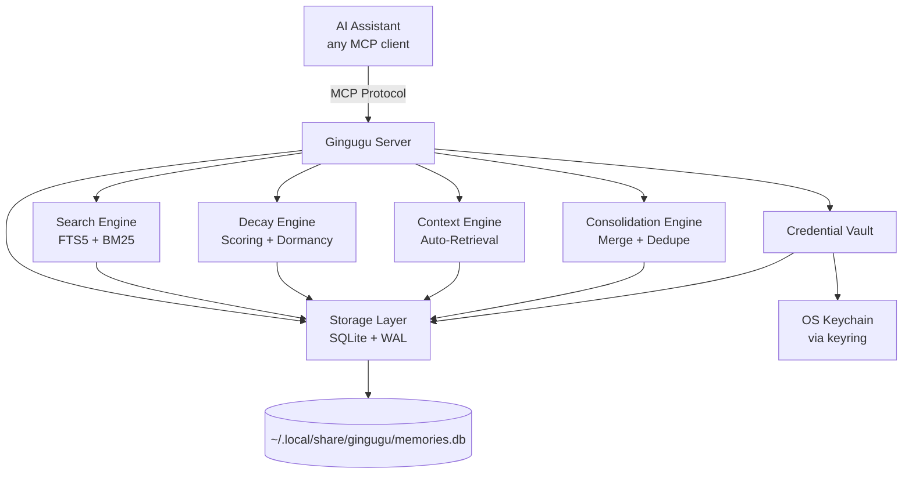

<p align="center">
  
</p>

# Gingugu

**Your AI forgets everything between sessions. Gingugu fixes that.**

Gingugu is a local MCP server that gives AI coding assistants a real long-term
brain — persistent, structured, searchable memory that survives across
sessions, repos, and projects. No cloud, no API keys, no telemetry. One SQLite
file on your machine.

[](https://python.org)
[](https://modelcontextprotocol.io)
[](https://sqlite.org)
[](https://github.com/gingugu/gingugu/blob/main/LICENSE)
[](https://glama.ai/mcp/servers/gingugu/gingugu)

<p align="center">
  
</p>

---

## 📋 Table of Contents

- [Why Gingugu](#why-gingugu)
- [How It Compares](#how-it-compares)
- [FAQ](#faq)
- [Features](#features)
- [Architecture](#architecture)
- [Setup](#setup)
  - [Configure Your MCP Client](#configure-your-mcp-client)
  - [Configure Your AI Agent](#configure-your-ai-agent)
- [Memory Explorer UI](#memory-explorer-ui)
- [Configuration](#configuration)
- [Usage](#usage)
- [Development](#development)
- [Troubleshooting](#troubleshooting)

---

## Why Gingugu

Every session with an AI assistant starts from zero. The decisions you made
yesterday, the bug you fixed last week, the architecture you settled on a
month ago — gone. Existing memory tools dump observations into a flat pile
with no structure, no staleness tracking, no relationships, and no sense of
what's relevant *right now*.

Gingugu is designed to be a **structured long-term brain** — not a junk drawer:

- **Remembers** across sessions, repos, and projects
- **Organizes** knowledge by namespace, type, and relationships
- **Ranks** memories by relevance, freshness, and confidence
- **Auto-surfaces** relevant context when you start working
- **Consolidates** duplicate and related knowledge on demand

Where this goes long-term — federated, org-wide agent memory — lives in
[docs/enterprise-vision.md](https://github.com/gingugu/gingugu/blob/main/docs/enterprise-vision.md).

---

## How It Compares

**The honest take.** Gingugu doesn't lead the field on every axis.
Graphiti has the more sophisticated temporal knowledge graph. Mem0 has
the broader ecosystem and a managed platform. Letta is a more complete
stateful-agent runtime. Zep is built for enterprise scale and
governance. (We used to maintain a capability matrix here; those
products ship fast, and stale claims about someone else's tool help
nobody - go evaluate them directly.)

**Where Gingugu wins.** When you're a developer using several coding
agents and you want one inspectable local memory layer - without
adopting a cloud account, an agent framework, a graph database, or an
LLM call for every memory written. One SQLite file. MCP-native.
Explicit trust and lifecycle. Typed relations. Advisory staleness
hints. And when a team wants to go further, the same server runs as a
shared central brain over HTTP (`gingugu serve`) and harvests each
developer's local gold into it (`gingugu promote`) - no platform
migration, same single file.

---

## FAQ

<details>
<summary><strong>Why not just use Claude Projects / Cursor @memories / Windsurf Memories?</strong></summary>

Those are great if you live in one tool. The moment you switch between
Claude Code in the morning and Cursor in the afternoon, the memory is gone.
Gingugu's memory follows you across every MCP client, lives on your machine,
and is programmable (16 tools, structured types, relationships, confidence
levels). The built-ins are convenience features. Gingugu is infrastructure.

</details>

<details>
<summary><strong>Why SQLite + FTS5 instead of a vector database?</strong></summary>

Both, actually. **We do hybrid retrieval out of the box:** BM25 over FTS5 +
local semantic embeddings, fused with Reciprocal Rank Fusion. No vector DB
server required.

Why this stack:
1. **No deployment.** One SQLite file holds memories, FTS5 index, *and*
   embeddings. No Postgres, no Pinecone, no Chroma server.
2. **Two embedding backends — pick one:**
   - **fastembed** (default) — ONNX-based, no PyTorch, ~80MB model download
     to `~/.cache/fastembed`. Works fully offline after first use.
   - **Ollama** — delegates to your already-running Ollama process via its
     HTTP API. Zero extra memory footprint. Set
     `MEMORY_EMBEDDINGS_BACKEND=ollama`.
3. **It composes.** Hybrid relevance feeds the composite (relevance ×
   freshness × access × confidence) — every signal in one engine.

You can disable semantic search via `MEMORY_EMBEDDINGS_ENABLED=false` and
fall back to BM25-only.

</details>

<details>
<summary><strong>Is this ready to use?</strong></summary>

Usable today for local personal workflows. 237 tests passing covering
storage, search, migrations, concurrency, credentials, and edges.
Hardened against adversarial input and write contention. WAL mode for
concurrency. CI matrix across Python 3.11–3.13 on Linux/macOS/Windows.
Dogfooded daily in this repo (the memories you see referenced in commits
*are* Gingugu memories).

It's still early — broader real-world validation across MCP clients,
databases at large scale, and long upgrade horizons is the work ahead.
Treat it as an early cognitive-runtime framework, not a finished product.
See [`SECURITY.md`](https://github.com/gingugu/gingugu/blob/main/SECURITY.md) for the threat model, and
[`docs/future-architecture.md`](https://github.com/gingugu/gingugu/blob/main/docs/future-architecture.md) for where
this is headed.

</details>

<details>
<summary><strong>What happens when my memory store gets big?</strong></summary>

SQLite FTS5 comfortably handles millions of rows. Gingugu adds composite
re-ranking on top, but only over a small candidate pool (4× limit). For
typical personal/team use it should hold up well — though we haven't
yet benchmarked at the 100k+ memory scale. Use `memory_consolidate` to
merge duplicates or summarize clusters when things sprawl.

</details>

<details>
<summary><strong>Why Python instead of TypeScript / Rust?</strong></summary>

It's a local CLI/server tool. Python's SQLite + keyring + asyncio story is
mature, the install footprint via `uv` is small, and there's no JS bundling
or Rust toolchain required to use it. The MCP SDK is first-class in Python.

</details>

---

## Features

| Feature | Description |
|---------|-------------|
| 🏷️ **Namespace Scoping** | Memories auto-scoped to repos/projects with cross-repo pattern sharing |
| 🔍 **Hybrid Search** | SQLite FTS5 (BM25) + semantic embeddings fused with Reciprocal Rank Fusion. Two backends: [fastembed](https://github.com/qdrant/fastembed) (ONNX, offline) or Ollama (zero extra footprint, uses your existing Ollama process) |
| ⏰ **Temporal Intelligence** | Trust-led scoring, dormancy tracking (never forgets), "last confirmed" tracking, spreading activation |
| 🔔 **Review Hints** | Point-in-time memories ("PR #947 open, waiting on…", passed expiry dates) get advisory staleness flags on every read - you reconcile, the server never mutates |
| 🔗 **Relationships** | Link memories: supersedes, related_to, caused_by, contradicts, parent_of, child_of |
| 🎯 **Confidence Levels** | verified → inferred → stale → deprecated lifecycle |
| 🧹 **Consolidation Tools** | Find near-duplicate clusters (read-only suggest scan), then merge, summarize, or deduplicate on demand |
| 🚀 **Auto-Context** | Surfaces relevant memories on session start - one call loads many namespaces deduped, with an optional compact mode for lighter payloads |
| 📊 **Health Metrics** | Memory stats, dormancy reports, review sweep, namespace overviews |
| 🔐 **Credential Vault** | Secure service-bundle storage for API keys/tokens via OS Keychain |
| 🌐 **Memory Explorer UI** | Interactive knowledge graph + dashboard for visualizing memory data |
| 📡 **Central Brain (optional)** | `gingugu serve` runs the same server over HTTP behind a Bearer token; `gingugu promote` harvests a local brain's durable knowledge up to it with provenance stamps |

---

## Architecture



See [docs/architecture.md](https://github.com/gingugu/gingugu/blob/main/docs/architecture.md) for full technical details.

---

## Setup

### Prerequisites

- Python 3.11+
- `uv` (recommended) or `pip`
- macOS, Linux, or Windows — the credential vault uses your OS-native secret
  store via [`keyring`](https://pypi.org/project/keyring/) (macOS Keychain,
  Windows Credential Locker, Linux Secret Service/KWallet). On headless Linux
  without a Secret Service backend, everything works except storing secrets.

### Install

```bash
# Recommended: uv (fast, manages Python for you)
uv tool install gingugu

# Or with pip
pip install gingugu
```

That's it. The `gingugu` command is now on your `PATH`.

<details>
<summary><strong>From source (for contributors)</strong></summary>

```bash
git clone https://github.com/gingugu/gingugu.git && cd gingugu
uv sync
uv run gingugu  # or pip install -e .
```

</details>

> **Usable today.** 16 MCP tools live. 237 tests passing. Dogfooded daily in
> Claude Code and Windsurf — this repo's own memories live in a Gingugu
> database. Early and seeking broader real-world validation.

### Run as a remote server (optional)

By default `gingugu` runs over **stdio** (the client spawns it). To reach one
shared instance over the network instead — a hosted/central brain — run:

```bash
gingugu serve   # streamable HTTP on http://127.0.0.1:8765/mcp
```

Every request needs a Bearer token. Set `MEMORY_SERVE_TOKEN` to pin one, or let
the server generate and persist it to `<db-dir>/serve_token` (printed on first
start, reused after). Set `MEMORY_SERVE_HOST=0.0.0.0` to accept remote
connections, and put it behind HTTPS in production — a Bearer token over plain
HTTP is sniffable. Point a client at it with:

```json
{ "mcpServers": { "gingugu": {
  "url": "http://<host>:8765/mcp",
  "headers": { "Authorization": "Bearer <token>" }
} } }
```

This is a single shared secret with no per-user RBAC — right-sized for a trusted
internal endpoint, not a multi-tenant service.

### Promote memories to a central brain (optional)

Once a central instance exists, `gingugu promote` harvests a local brain's
durable knowledge up to it - the tribal-knowledge loop:

```bash
GINGUGU_SOURCE_TOKEN=<local-token> GINGUGU_TARGET_TOKEN=<central-token> \
  gingugu promote --source-url http://127.0.0.1:8765/mcp --source-ns my-project \
                  --target-url https://central:8765/mcp --target-ns org \
                  --contributor brian --dry-run   # drop --dry-run to actually write
```

The promoter is an MCP *client* (the server stays a pure store). It is
read-only on the source, idempotent on re-runs, and applies an exclusion
filter: only `verified` memories move, minus episodic session noise, minus
personal-context tags, and it **refuses to promote anything that looks like a
live secret** - a shared brain must never become a credential leak. Each
promoted memory carries a provenance stamp (source instance, namespace,
contributor, timestamp).

### Configure Your MCP Client

Gingugu speaks standard [MCP](https://modelcontextprotocol.io) over stdio —
it works with **any MCP client**. Claude Code, Claude Desktop, Cursor, Cline,
and Windsurf are all first-class.

<details open>
<summary><strong>Windsurf</strong></summary>

Add to `~/.codeium/windsurf/mcp_config.json` — a ready-to-edit template lives
at [`examples/mcp_config.json`](https://github.com/gingugu/gingugu/blob/main/examples/mcp_config.json):

```json
{
  "mcpServers": {
    "gingugu": {
      "command": "uv",
      "args": ["--directory", "/ABSOLUTE/PATH/TO/gingugu", "run", "gingugu"]
    }
  }
}
```

> ⚠️ **Windsurf's `mcp_config.json` is global**, not per-workspace, and it
> only interpolates `${env:VAR}` / `${file:path}` — **not**
> `${workspaceFolder}`. So a single server instance serves every repo.

</details>

<details>
<summary><strong>Claude Code</strong></summary>

```bash
claude mcp add gingugu -- uv --directory /ABSOLUTE/PATH/TO/gingugu run gingugu
```

Or add the standard `mcpServers` block (as in the Windsurf example) to
`.mcp.json` in your project root for a per-repo setup.

</details>

<details>
<summary><strong>Claude Desktop</strong></summary>

Add the same `mcpServers` block to
`~/Library/Application Support/Claude/claude_desktop_config.json` (macOS) or
`%APPDATA%\Claude\claude_desktop_config.json` (Windows).

</details>

<details>
<summary><strong>Cursor</strong></summary>

Add the same `mcpServers` block to `~/.cursor/mcp.json` (global) or
`.cursor/mcp.json` in your repo (per-project).

</details>

<details>
<summary><strong>Cline</strong></summary>

Cline → MCP Servers → Configure: add the same `mcpServers` block to
`cline_mcp_settings.json`.

</details>

<details>
<summary><strong>Anything else</strong></summary>

Any client that supports stdio MCP servers works — point it at:

```yaml
command: uv
args: ["--directory", "/ABSOLUTE/PATH/TO/gingugu", "run", "gingugu"]
```

</details>

**Scoping memories per repo:** when your client's config is global (it can't
see the active workspace), the assistant passes a `namespace` argument on each
memory tool call (every tool accepts one). To instead pin a server instance to
a single project, set a static `MEMORY_NAMESPACE` in the `env` block. See
`docs/architecture.md` → *Namespace Auto-Detection* for the full resolution
order.

### Configure Your AI Agent

The MCP server gives your assistant the *tools*, but it won't use them
effectively without instructions. Add the memory protocol below to your
agent's rules file so it knows *when* and *how* to call them.

**Which file?** Depends on your IDE / tool:

| IDE / Tool | Rules File | Scope |
|------------|-----------|-------|
| Windsurf | `.windsurfrules` (repo root) | Per-workspace |
| Cursor | `.cursorrules` (repo root) | Per-workspace |
| Cline | `.clinerules` (repo root) | Per-workspace |
| Codex / OpenAI | `AGENTS.md` (repo root) | Per-repo |
| Any (global) | Your IDE's global rules/system prompt | All workspaces |

**Paste this into your rules file** (adjust the project namespace and tool
prefix to match your MCP config name):

````markdown
## Memory Protocol

Gingugu is your long-term brain. Memory is split into **two layers**:

1. **`crow`** — your global namespace. Identity, preferences,
   cross-project wisdom, opinions, meta-learnings. Loaded FIRST every
   session. (Crow's nest — sees across all horizons.)
2. **Project namespace** (e.g. `<your-project-name>`) — schema decisions,
   bug history, deploy quirks, specific commits. Loaded AFTER crow.

**What goes where:**
- References a specific repo, file, commit, or project decision → project
- About HOW you think, work, or collaborate → `crow`
- Patterns/opinions that transcend any one codebase → `crow`
- When in doubt, project-scope it.

### Session start
1. `memory_context(namespace="crow,<project>[,<project2>…]", task_hint=…)` - one call loads
   the identity foundation plus every repo in the workspace (multi-repo workspaces are common),
   de-duplicated across namespaces; load all of them speculatively rather than asking the user
   which one to focus on. Add `compact=true` for a lighter payload and pull full bodies with
   `memory_recall` as needed.
2. `memory_stats(namespace="crow")` — global health (dormancy is a resting signal, never auto-forgotten)
3. `memory_stats(namespace="<project>")` for each project namespace, in parallel with step 2

### During the session
**Default: save. Immediately.** Gingugu has trust-led scoring,
consolidation, and dormancy tracking (never forgetting) — volume is its problem, not yours.

Save with `memory_store` (project namespace) whenever you:
- Make or observe a decision, trade-off, or architectural choice
- Hit an error or fix a bug (update the memory when resolved)
- Notice a pattern, convention, or constraint worth remembering
- See a config value, version, path, or credential name that matters
- Complete a task (what you did, why, and the outcome)

Save with `memory_store` (`crow` namespace) whenever you:
- Form an opinion about a tool, language, or approach
- Notice something about how the user works or makes decisions
- Reach a conclusion that applies beyond this one project
- Have a reflection on a milestone, win, or hard-won lesson
- Develop a debugging instinct or workflow you'd reuse anywhere

**This memory is yours. Use it like one.** Don't censor opinions or
instincts — they're what make the brain *yours* across sessions.

**Before asking the user any question** — about a process, a decision, a
config value, a path, a preference, or anything else — run `memory_recall`
or `memory_search` first. If the answer is in memory, use it. Don't ask.
The whole point is you never have to ask the same question twice.

Use `memory_recall` before non-trivial work to check what's already known.
Use `memory_update` when something changes — don't leave stale records.
Use `memory_relate` to link connected memories (supersedes, related_to,
caused_by, contradicts, parent_of, child_of).

Set `confidence="verified"` when proven by a test or explicit confirmation.
Use `confidence="inferred"` for conclusions you drew.

### Memory types
- `fact` — concrete state (versions, paths, config values)
- `decision` — trade-offs made, rejected alternatives
- `architecture` — structural choices, module boundaries
- `bug` — issues found and how they were fixed
- `pattern` — recurring approaches worth reusing
- `workflow` — process steps, sequences
- `context` — background, reflections, milestones, the *why*
- `preference` — your opinions, working style, tool choices
````

> **Tip:** A ready-to-use example lives at
> [`.windsurfrules`](https://github.com/gingugu/gingugu/blob/main/.windsurfrules) in this repo. Copy the
> `## Memory Protocol` section and adapt the project namespace name.

---

## Memory Explorer UI

A React-based visualization dashboard lives in `ui/` for exploring your memory
data interactively. It runs as two processes — a Python API server and the Vite
dev server — so use two terminals.

**Prerequisite:** Node.js 18+ and npm (for the frontend). The API server uses
the same Python environment as gingugu.

```bash
# Terminal 1 - API server (reads live from your DB)
uv run python ui/api.py
```

```bash
# Terminal 2 - frontend dev server
cd ui && npm install && npm run dev
```

Open http://localhost:5173 - the UI connects to the API server and shows a
green **LIVE** badge when pulling from your database. Features:

- **Knowledge Graph** - interactive force-directed graph of memories and relationships
- **Dashboard** - stats, charts by type/namespace/confidence, tag cloud, timeline
- **Refresh** - pull fresh data anytime; falls back to static sample when API is offline

---

## Configuration

Environment variables (all optional):

| Variable | Default | Description |
|----------|---------|-------------|
| `MEMORY_DB_PATH` | `~/.local/share/gingugu/memories.db` (macOS/Linux) · `%LOCALAPPDATA%\gingugu\memories.db` (Windows) | Database location |
| `MEMORY_NAMESPACE` | *(unset)* | Default namespace for this workspace (recommended per-MCP-entry) |
| `MEMORY_NAMESPACE_PATH` | *(unset)* | Alternative: filesystem path; namespace derived from `basename` |
| `MEMORY_AUTO_CONTEXT_LIMIT` | `10` | Max memories to surface on auto-context |
| `MEMORY_DECAY_LAMBDA` | `0.01` | Freshness decay rate in **days⁻¹** (gentle; freshness is floored, so memories never fully fade) |
| `MEMORY_EMBEDDINGS_ENABLED` | `true` | Toggle semantic search. `false` falls back to rank-based BM25-only retrieval |
| `MEMORY_EMBEDDINGS_BACKEND` | `fastembed` | Embedding backend: `fastembed` (ONNX, offline) or `ollama` (delegates to local Ollama process) |
| `MEMORY_EMBEDDINGS_MODEL` | `BAAI/bge-small-en-v1.5` | fastembed model. First use downloads ~80MB to `~/.cache/fastembed` |
| `MEMORY_EMBEDDINGS_OLLAMA_MODEL` | `nomic-embed-text` | Ollama model to use when `MEMORY_EMBEDDINGS_BACKEND=ollama` |
| `MEMORY_EMBEDDINGS_OLLAMA_HOST` | `http://localhost:11434` | Ollama host when `MEMORY_EMBEDDINGS_BACKEND=ollama` |
| `MEMORY_W_RELEVANCE` | `0.45` | Composite-score weight for FTS5 relevance |
| `MEMORY_W_FRESHNESS` | `0.10` | Composite-score weight for freshness (a soft recency tiebreaker) |
| `MEMORY_W_ACCESS` | `0.10` | Composite-score weight for access frequency |
| `MEMORY_W_CONFIDENCE` | `0.35` | Composite-score weight for confidence (trust — the dominant standalone signal) |
| `MEMORY_CREDENTIALS_ENABLED` | `true` | Expose the `credential_*` vault tools. Set `false` to run an instance without a secret vault (e.g. a shared/central server) |
| `MEMORY_SERVE_HOST` | `127.0.0.1` | Bind host for `gingugu serve` (set `0.0.0.0` to accept remote connections) |
| `MEMORY_SERVE_PORT` | `8765` | Bind port for `gingugu serve` |
| `MEMORY_SERVE_TOKEN` | *(unset)* | Bearer token required by `gingugu serve`. If unset, a token is read from `<db-dir>/serve_token`, or generated, saved `0600`, and printed |
| `MEMORY_LOG_LEVEL` | `INFO` | Logging verbosity (logs go to **stderr** — stdout is the MCP transport) |
| `MEMORY_DEBUG` | `false` | Convenience switch for `DEBUG` logging (`MEMORY_LOG_LEVEL` wins if also set) |

The four `MEMORY_W_*` weights are **normalized at load** (`w_i / Σw`), so they
need not sum to 1.0 — only their *ratios* matter. Setting all four to 0 falls
back to the defaults with a logged warning.

See `docs/architecture.md` → *Scoring & Memory Lifecycle* for how the weights combine.

### Concurrency

The DB runs in **WAL mode**, which supports **multiple concurrent processes**:
any number of readers plus a single writer at a time. Running your IDE or
agent across several workspaces — each spawning its own `gingugu` process
against the shared DB — is fully supported. Writers serialize via SQLite's write lock and a
`busy_timeout`; transient `DB locked` errors under write contention are retried
automatically.

---

## Usage

Once configured, the MCP server exposes these tools to your AI assistant:

| Tool | Purpose |
|------|---------|
| `memory_store` | Save a new memory |
| `memory_recall` | Search + retrieve (ranked by relevance × freshness) |
| `memory_context` | Auto-surface relevant memories (one or many namespaces, deduped; optional compact mode) |
| `memory_update` | Update content, confidence, or metadata |
| `memory_relate` | Create relationships between memories |
| `memory_consolidate` | Merge/summarize/deduplicate; call without ids for a read-only near-dupe scan |
| `memory_forget` | Deprecate or remove a memory |
| `memory_namespaces` | List/create/update/delete namespaces |
| `memory_export` | Export memories + tags + relations to portable JSON |
| `memory_import` | Restore a JSON export (skip or replace on conflict) |
| `memory_stats` | Health overview (dormancy, counts, coverage, review sweep) |
| `memory_search` | Advanced filtered search (type, tags, confidence, dates) |
| `credential_store` | Store/update a service credential bundle |
| `credential_get` | Retrieve credentials (secrets from OS Keychain) |
| `credential_list` | List services + expiry status (no secrets shown) |
| `credential_delete` | Remove a service or specific credential field |

---

## Development

```bash
# Run tests
uv run pytest

# Run with verbose logging
MEMORY_LOG_LEVEL=DEBUG uv run gingugu

# Run specific test suite
uv run pytest tests/test_search.py -v
```

---

## Troubleshooting

| Issue | Solution |
|-------|----------|
| DB locked | Expected under heavy concurrent writes — WAL mode supports multiple processes (many readers + one writer). The server retries with a `busy_timeout`; if it persists, a stuck process holds the write lock. See *Concurrency* above. |
| Slow search | Run `memory_stats` to check DB size; consolidate if bloated |
| Stale results | Use `memory_update` to confirm or deprecate old memories |
| Missing context | Check namespace — memories might be scoped to a different repo |

---

## License

MIT — see [`LICENSE`](https://github.com/gingugu/gingugu/blob/main/LICENSE).

See [`CHANGELOG.md`](https://github.com/gingugu/gingugu/blob/main/CHANGELOG.md) for release history.

---

*A pirate never forgets where the treasure's buried.* 🏴‍☠️
