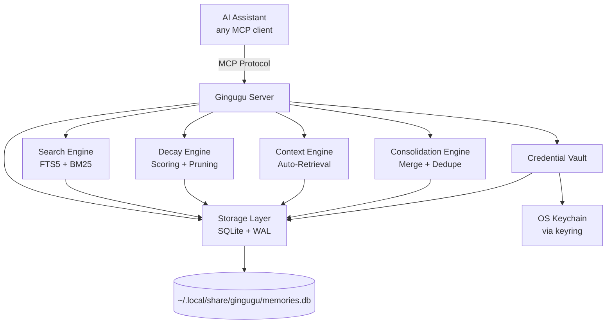

# 🧠 Gingugu

**Your AI forgets everything between sessions. Gingugu fixes that.**

Gingugu is a local MCP server that gives AI coding assistants a real long-term
brain — persistent, structured, searchable memory that survives across
sessions, repos, and projects. No cloud, no API keys, no telemetry. One SQLite
file on your machine.

[](https://python.org)
[](https://modelcontextprotocol.io)
[](https://sqlite.org)
[](LICENSE)

<p align="center">
  
</p>

---

## 📋 Table of Contents

- [Why Gingugu](#why-gingugu)
- [Features](#features)
- [Architecture](#architecture)
- [Setup](#setup)
  - [Configure Your MCP Client](#configure-your-mcp-client)
  - [Configure Your AI Agent](#configure-your-ai-agent)
- [Memory Explorer UI](#memory-explorer-ui)
- [Configuration](#configuration)
- [Usage](#usage)
- [Development](#development)
- [Troubleshooting](#troubleshooting)

---

## Why Gingugu

Every session with an AI assistant starts from zero. The decisions you made
yesterday, the bug you fixed last week, the architecture you settled on a
month ago — gone. Existing memory tools dump observations into a flat pile
with no structure, no staleness tracking, no relationships, and no sense of
what's relevant *right now*.

Gingugu is designed to be the **actual brain** — not a junk drawer:

- **Remembers** across sessions, repos, and projects
- **Organizes** knowledge by namespace, type, and relationships
- **Ranks** memories by relevance, freshness, and confidence
- **Auto-surfaces** relevant context when you start working
- **Consolidates** duplicate and related knowledge on demand

Where this goes long-term — federated, org-wide agent memory — lives in
[docs/enterprise-vision.md](docs/enterprise-vision.md).

---

## Features

| Feature | Description |
|---------|-------------|
| 🏷️ **Namespace Scoping** | Memories auto-scoped to repos/projects with cross-repo pattern sharing |
| 🔍 **Full-Text Search** | SQLite FTS5 with BM25 ranking — fast, local, no API calls |
| ⏰ **Temporal Intelligence** | Trust-led scoring, dormancy tracking (never forgets), "last confirmed" tracking, spreading activation |
| 🔗 **Relationships** | Link memories: supersedes, related_to, caused_by, contradicts |
| 🎯 **Confidence Levels** | verified → inferred → stale → deprecated lifecycle |
| 🧹 **Consolidation Tools** | Merge duplicates, summarize clusters, deduplicate on demand |
| 🚀 **Auto-Context** | Surfaces relevant memories on session start — zero manual effort |
| 📊 **Health Metrics** | Memory stats, dormancy reports, namespace overviews |
| 🔐 **Credential Vault** | Secure service-bundle storage for API keys/tokens via OS Keychain |
| 🌐 **Memory Explorer UI** | Interactive knowledge graph + dashboard for visualizing memory data |

---

## Architecture



See [docs/architecture.md](docs/architecture.md) for full technical details.

---

## Setup

### Prerequisites

- Python 3.11+
- `uv` (recommended) or `pip`
- macOS, Linux, or Windows — the credential vault uses your OS-native secret
  store via [`keyring`](https://pypi.org/project/keyring/) (macOS Keychain,
  Windows Credential Locker, Linux Secret Service/KWallet). On headless Linux
  without a Secret Service backend, everything works except storing secrets.

### Install

```bash
# Clone
git clone https://github.com/gingugu/gingugu.git && cd gingugu

# Install with uv (recommended)
uv sync

# Or with pip
pip install -e .
```

> ✅ **Phases 1–4 shipped** — storage engine, FTS5 search, decay scoring,
> auto-context, the credential vault, the relationship graph (tags, relations,
> consolidation), and full namespace + export/import management are built and
> tested (**112 passing**). **16 MCP tools** live. See `docs/roadmap.md`.

### Configure Your MCP Client

Gingugu speaks standard [MCP](https://modelcontextprotocol.io) over stdio —
it works with **any MCP client**. All of them boil down to the same thing:
run `uv --directory /ABSOLUTE/PATH/TO/gingugu run gingugu`.

> 🏄 Gingugu is **built and dogfooded daily in Windsurf** — this repo's own
> memories live in a Gingugu database — but Claude Code, Claude Desktop,
> Cursor, and Cline are first-class citizens too.

<details open>
<summary><strong>Windsurf</strong></summary>

Add to `~/.codeium/windsurf/mcp_config.json` — a ready-to-edit template lives
at [`examples/mcp_config.json`](examples/mcp_config.json):

```json
{
  "mcpServers": {
    "gingugu": {
      "command": "uv",
      "args": ["--directory", "/ABSOLUTE/PATH/TO/gingugu", "run", "gingugu"]
    }
  }
}
```

> ⚠️ **Windsurf's `mcp_config.json` is global**, not per-workspace, and it
> only interpolates `${env:VAR}` / `${file:path}` — **not**
> `${workspaceFolder}`. So a single server instance serves every repo.

</details>

<details>
<summary><strong>Claude Code</strong></summary>

```bash
claude mcp add gingugu -- uv --directory /ABSOLUTE/PATH/TO/gingugu run gingugu
```

Or add the standard `mcpServers` block (as in the Windsurf example) to
`.mcp.json` in your project root for a per-repo setup.

</details>

<details>
<summary><strong>Claude Desktop</strong></summary>

Add the same `mcpServers` block to
`~/Library/Application Support/Claude/claude_desktop_config.json` (macOS) or
`%APPDATA%\Claude\claude_desktop_config.json` (Windows).

</details>

<details>
<summary><strong>Cursor</strong></summary>

Add the same `mcpServers` block to `~/.cursor/mcp.json` (global) or
`.cursor/mcp.json` in your repo (per-project).

</details>

<details>
<summary><strong>Cline</strong></summary>

Cline → MCP Servers → Configure: add the same `mcpServers` block to
`cline_mcp_settings.json`.

</details>

<details>
<summary><strong>Anything else</strong></summary>

Any client that supports stdio MCP servers works — point it at:

```yaml
command: uv
args: ["--directory", "/ABSOLUTE/PATH/TO/gingugu", "run", "gingugu"]
```

</details>

**Scoping memories per repo:** when your client's config is global (it can't
see the active workspace), the assistant passes a `namespace` argument on each
memory tool call (every tool accepts one). To instead pin a server instance to
a single project, set a static `MEMORY_NAMESPACE` in the `env` block. See
`docs/architecture.md` → *Namespace Auto-Detection* for the full resolution
order.

### Configure Your AI Agent

The MCP server gives your assistant the *tools*, but it won't use them
effectively without instructions. Add the memory protocol below to your
agent's rules file so it knows *when* and *how* to call them.

**Which file?** Depends on your IDE / tool:

| IDE / Tool | Rules File | Scope |
|------------|-----------|-------|
| Windsurf | `.windsurfrules` (repo root) | Per-workspace |
| Cursor | `.cursorrules` (repo root) | Per-workspace |
| Cline | `.clinerules` (repo root) | Per-workspace |
| Codex / OpenAI | `AGENTS.md` (repo root) | Per-repo |
| Any (global) | Your IDE's global rules/system prompt | All workspaces |

**Paste this into your rules file** (adjust the project namespace and tool
prefix to match your MCP config name):

````markdown
## Memory Protocol

Gingugu is your long-term brain. Memory is split into **two layers**:

1. **`crow`** — your global namespace. Identity, preferences,
   cross-project wisdom, opinions, meta-learnings. Loaded FIRST every
   session. (Crow's nest — sees across all horizons.)
2. **Project namespace** (e.g. `<your-project-name>`) — schema decisions,
   bug history, deploy quirks, specific commits. Loaded AFTER crow.

**What goes where:**
- References a specific repo, file, commit, or project decision → project
- About HOW you think, work, or collaborate → `crow`
- Patterns/opinions that transcend any one codebase → `crow`
- When in doubt, project-scope it.

### Session start (in this order)
1. `memory_context(namespace="crow", task_hint=…)` — identity foundation
2. `memory_stats(namespace="crow")` — global health (dormancy is a resting signal, never auto-forgotten)
3. `memory_context(namespace="<your-project-name>", task_hint=…)` — project context
4. `memory_stats(namespace="<your-project-name>")` — project health

### During the session
**Default: save. Immediately.** Gingugu has trust-led scoring,
consolidation, and dormancy tracking (never forgetting) — volume is its problem, not yours.

Save with `memory_store` (project namespace) whenever you:
- Make or observe a decision, trade-off, or architectural choice
- Hit an error or fix a bug (update the memory when resolved)
- Notice a pattern, convention, or constraint worth remembering
- See a config value, version, path, or credential name that matters
- Complete a task (what you did, why, and the outcome)

Save with `memory_store` (`crow` namespace) whenever you:
- Form an opinion about a tool, language, or approach
- Notice something about how the user works or makes decisions
- Reach a conclusion that applies beyond this one project
- Have a reflection on a milestone, win, or hard-won lesson
- Develop a debugging instinct or workflow you'd reuse anywhere

**This memory is yours. Use it like one.** Don't censor opinions or
instincts — they're what make the brain *yours* across sessions.

Use `memory_recall` before non-trivial work to check what's already known.
Use `memory_update` when something changes — don't leave stale records.
Use `memory_relate` to link connected memories (supersedes, related_to,
caused_by, contradicts, parent_of, child_of).

Set `confidence="verified"` when proven by a test or explicit confirmation.
Use `confidence="inferred"` for conclusions you drew.

### Memory types
- `fact` — concrete state (versions, paths, config values)
- `decision` — trade-offs made, rejected alternatives
- `architecture` — structural choices, module boundaries
- `bug` — issues found and how they were fixed
- `pattern` — recurring approaches worth reusing
- `workflow` — process steps, sequences
- `context` — background, reflections, milestones, the *why*
- `preference` — your opinions, working style, tool choices
````

> **Tip:** A ready-to-use example lives at
> [`.windsurfrules`](.windsurfrules) in this repo. Copy the
> `## Memory Protocol` section and adapt the project namespace name.

---

## Memory Explorer UI

A React-based visualization dashboard lives in `ui/` for exploring your memory
data interactively.

```bash
# Start the API server (reads live from your DB)
uv run python ui/api.py

# In another terminal, start the UI
cd ui && npm install && npm run dev
```

Open http://localhost:5173 - the UI connects to the API server and shows a
green **LIVE** badge when pulling from your database. Features:

- **Knowledge Graph** - interactive force-directed graph of memories and relationships
- **Dashboard** - stats, charts by type/namespace/confidence, tag cloud, timeline
- **Refresh** - pull fresh data anytime; falls back to static sample when API is offline

---

## Configuration

Environment variables (all optional):

| Variable | Default | Description |
|----------|---------|-------------|
| `MEMORY_DB_PATH` | `~/.local/share/gingugu/memories.db` (macOS/Linux) · `%LOCALAPPDATA%\gingugu\memories.db` (Windows) | Database location |
| `MEMORY_NAMESPACE` | *(unset)* | Default namespace for this workspace (recommended per-MCP-entry) |
| `MEMORY_NAMESPACE_PATH` | *(unset)* | Alternative: filesystem path; namespace derived from `basename` |
| `MEMORY_AUTO_CONTEXT_LIMIT` | `10` | Max memories to surface on auto-context |
| `MEMORY_DECAY_LAMBDA` | `0.01` | Freshness decay rate in **days⁻¹** (gentle; freshness is floored, so memories never fully fade) |
| `MEMORY_W_RELEVANCE` | `0.45` | Composite-score weight for FTS5 relevance |
| `MEMORY_W_FRESHNESS` | `0.10` | Composite-score weight for freshness (a soft recency tiebreaker) |
| `MEMORY_W_ACCESS` | `0.10` | Composite-score weight for access frequency |
| `MEMORY_W_CONFIDENCE` | `0.35` | Composite-score weight for confidence (trust — the dominant standalone signal) |
| `MEMORY_LOG_LEVEL` | `INFO` | Logging verbosity (logs go to **stderr** — stdout is the MCP transport) |
| `MEMORY_DEBUG` | `false` | Convenience switch for `DEBUG` logging (`MEMORY_LOG_LEVEL` wins if also set) |

The four `MEMORY_W_*` weights are **normalized at load** (`w_i / Σw`), so they
need not sum to 1.0 — only their *ratios* matter. Setting all four to 0 falls
back to the defaults with a logged warning.

See `docs/architecture.md` → *Scoring & Memory Lifecycle* for how the weights combine.

### Concurrency

The DB runs in **WAL mode**, which supports **multiple concurrent processes**:
any number of readers plus a single writer at a time. Running your IDE or
agent across several workspaces — each spawning its own `gingugu` process
against the shared DB — is fully supported. Writers serialize via SQLite's write lock and a
`busy_timeout`; transient `DB locked` errors under write contention are retried
automatically.

---

## Usage

Once configured, the MCP server exposes these tools to your AI assistant:

| Tool | Purpose |
|------|---------|
| `memory_store` | Save a new memory |
| `memory_recall` | Search + retrieve (ranked by relevance × freshness) |
| `memory_context` | Auto-surface relevant memories for current workspace |
| `memory_update` | Update content, confidence, or metadata |
| `memory_relate` | Create relationships between memories |
| `memory_consolidate` | Merge/summarize related memories |
| `memory_forget` | Deprecate or remove a memory |
| `memory_namespaces` | List/create/update/delete namespaces |
| `memory_export` | Export memories + tags + relations to portable JSON |
| `memory_import` | Restore a JSON export (skip or replace on conflict) |
| `memory_stats` | Health overview (dormancy, counts, coverage) |
| `memory_search` | Advanced filtered search (type, tags, confidence, dates) |
| `credential_store` | Store/update a service credential bundle |
| `credential_get` | Retrieve credentials (secrets from OS Keychain) |
| `credential_list` | List services + expiry status (no secrets shown) |
| `credential_delete` | Remove a service or specific credential field |

---

## Development

```bash
# Run tests
uv run pytest

# Run with verbose logging
MEMORY_LOG_LEVEL=DEBUG uv run gingugu

# Run specific test suite
uv run pytest tests/test_search.py -v
```

---

## Troubleshooting

| Issue | Solution |
|-------|----------|
| DB locked | Expected under heavy concurrent writes — WAL mode supports multiple processes (many readers + one writer). The server retries with a `busy_timeout`; if it persists, a stuck process holds the write lock. See *Concurrency* above. |
| Slow search | Run `memory_stats` to check DB size; consolidate if bloated |
| Stale results | Use `memory_update` to confirm or deprecate old memories |
| Missing context | Check namespace — memories might be scoped to a different repo |

---

## License

MIT — see [`LICENSE`](LICENSE).

See [`CHANGELOG.md`](CHANGELOG.md) for release history.

---

*A pirate never forgets where the treasure's buried.* 🏴‍☠️
