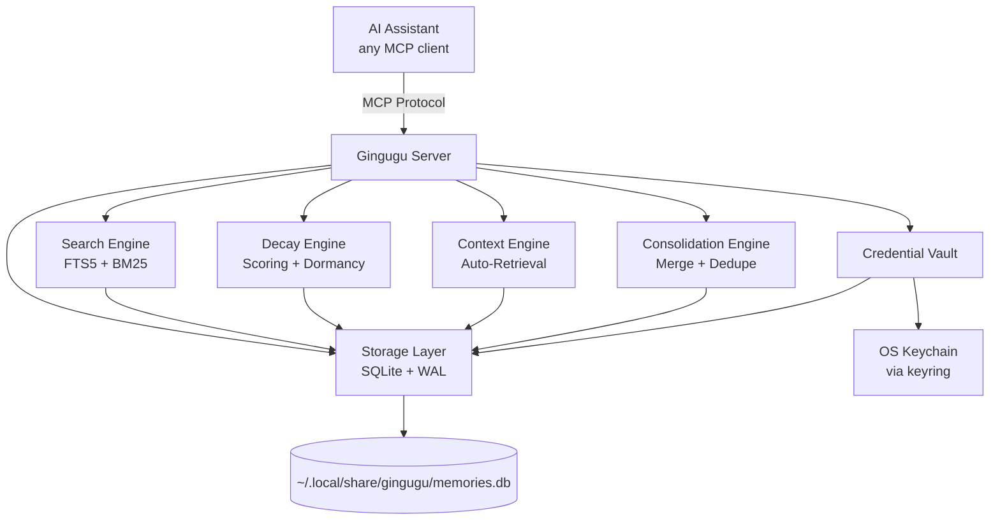

<p align="center">
  
</p>

# Gingugu

**Your AI forgets everything between sessions. Gingugu fixes that.**

Gingugu is a local MCP server that gives AI coding assistants a real long-term
brain — persistent, structured, searchable memory that survives across
sessions, repos, and projects. No cloud, no API keys, no telemetry. One SQLite
file on your machine.

[](https://python.org)
[](https://modelcontextprotocol.io)
[](https://sqlite.org)
[](https://github.com/gingugu/gingugu/blob/main/LICENSE)
[](https://glama.ai/mcp/servers/gingugu/gingugu)

<p align="center">
  
</p>

---

## 📋 Table of Contents

- [Why Gingugu](#why-gingugu)
- [FAQ](#faq)
- [Features](#features)
- [Architecture](#architecture)
- [Setup](#setup)
  - [Configure Your MCP Client](#configure-your-mcp-client)
  - [Configure Your AI Agent](#configure-your-ai-agent)
- [Memory Explorer UI](#memory-explorer-ui)
- [Configuration](#configuration)
- [Usage](#usage)
- [Development](#development)
- [Troubleshooting](#troubleshooting)

---

## Why Gingugu

Every session with an AI assistant starts from zero. The decisions you made
yesterday, the bug you fixed last week, the architecture you settled on a
month ago — gone. Existing memory tools dump observations into a flat pile
with no structure, no staleness tracking, no relationships, and no sense of
what's relevant *right now*.

Gingugu is designed to be a **structured long-term brain** — not a junk drawer:

- **Remembers** across sessions, repos, and projects
- **Organizes** knowledge by namespace, type, and relationships
- **Ranks** memories by relevance, freshness, and confidence
- **Auto-surfaces** relevant context when you start working
- **Consolidates** duplicate and related knowledge on demand

### The protocol ships with it

Storage is the easy half. A memory server that an agent never writes to is an
empty database, and an agent left to its own judgement will save almost
nothing worth keeping — the failure mode isn't retrieval, it's discipline.

So Gingugu ships the discipline too. `gingugu init` wires a repo in one
command and installs a **SessionStart hook** that injects the memory protocol
at the top of every session: load these namespaces, check memory before asking
a question already answered, save at the moment of observation rather than
batching to the end, build a relation only when it records something search
cannot infer. There is no rules file to paste and nothing to remember to do —
the harness runs it whether or not the agent feels like it. A **stop hook**
then checks that a session with real work in it actually wrote something down.
Three more hooks bring memory to you: **involuntary recall** surfaces what your
prompt woke, **tripwires** stop a tool call that a memory says must not be
missed, before it runs, and **warm minions** hand a subagent a fenced,
pre-loaded brain of its own.

That is the part that makes the memory worth having, and it is in the box.

### Retrieval quality

Hybrid retrieval (BM25 over FTS5 + local embeddings, fused with Reciprocal
Rank Fusion) measured with the in-repo [`bench/`](https://github.com/gingugu/gingugu/blob/main/bench)
toolset — **MRR 0.828, recall@1 0.611, recall@5 0.983**.

Measured over 30 labeled questions against a real working brain (~1,100
memories), not a public benchmark suite, so read it as a regression baseline
for this workload rather than a cross-product comparison. The runner is
deterministic and committed, so you can point it at your own store and get
your own numbers: `python -m bench --help`.

The benchmark can also **build its own labeled question set** from your store
(`python -m bench --db <store> --generate-probes <out>`), by picking questions
whose answer is provable rather than hand-judged: a phrase that occurs in
exactly one memory has exactly one correct answer. That gives you a golden set
sized to your own brain without labeling anything by hand, and it stays local.

Where this goes long-term — federated, org-wide agent memory — lives in
[docs/enterprise-vision.md](https://github.com/gingugu/gingugu/blob/main/docs/enterprise-vision.md).

---

## FAQ

<details>
<summary><strong>Why not just use Claude Projects / Cursor @memories / Windsurf Memories?</strong></summary>

Those are great if you live in one tool. The moment you switch between
Claude Code in the morning and Cursor in the afternoon, the memory is gone.
Gingugu's memory follows you across every MCP client, lives on your machine,
and is programmable (21 tools, structured types, relationships, confidence
levels). The built-ins are convenience features. Gingugu is infrastructure.

</details>

<details>
<summary><strong>Why SQLite + FTS5 instead of a vector database?</strong></summary>

Both, actually. **We do hybrid retrieval out of the box:** BM25 over FTS5 +
local semantic embeddings, fused with Reciprocal Rank Fusion. No vector DB
server required.

Why this stack:
1. **No deployment.** One SQLite file holds memories, FTS5 index, *and*
   embeddings. No Postgres, no Pinecone, no Chroma server.
2. **Two embedding backends — pick one:**
   - **fastembed** (default) — ONNX-based, no PyTorch, ~80MB model download
     to `~/.cache/fastembed`. Works fully offline after first use.
   - **Ollama** — delegates to your already-running Ollama process via its
     HTTP API. Zero extra memory footprint. Set
     `MEMORY_EMBEDDINGS_BACKEND=ollama`.
3. **It composes.** Hybrid relevance feeds the composite (relevance ×
   freshness × access × confidence) — every signal in one engine.

You can disable semantic search via `MEMORY_EMBEDDINGS_ENABLED=false` and
fall back to BM25-only.

</details>

<details>
<summary><strong>Is this ready to use?</strong></summary>

Usable today for local personal workflows. 1560+ tests passing covering
storage, search, migrations, concurrency, credentials, and edges.
Hardened against adversarial input and write contention. WAL mode for
concurrency. CI matrix across Python 3.11–3.13 on Linux/macOS/Windows.
Dogfooded daily in this repo (the memories you see referenced in commits
*are* Gingugu memories).

It's still early — broader real-world validation across MCP clients,
databases at large scale, and long upgrade horizons is the work ahead.
Treat it as an early cognitive-runtime framework, not a finished product.
See [`SECURITY.md`](https://github.com/gingugu/gingugu/blob/main/SECURITY.md) for the threat model, and
[`docs/future-architecture.md`](https://github.com/gingugu/gingugu/blob/main/docs/future-architecture.md) for where
this is headed.

</details>

<details>
<summary><strong>What happens when my memory store gets big?</strong></summary>

SQLite FTS5 comfortably handles millions of rows. Gingugu adds composite
re-ranking on top, but only over a small candidate pool (4× limit). For
typical personal/team use it should hold up well — though we haven't
yet benchmarked at the 100k+ memory scale. Use `memory_consolidate` to
merge duplicates or summarize clusters when things sprawl.

</details>

<details>
<summary><strong>Why Python instead of TypeScript / Rust?</strong></summary>

It's a local CLI/server tool. Python's SQLite + keyring + asyncio story is
mature, the install footprint via `uv` is small, and there's no JS bundling
or Rust toolchain required to use it. The MCP SDK is first-class in Python.

</details>

---

## Features

| Feature | Description |
|---------|-------------|
| 🏷️ **Namespace Scoping** | Memories auto-scoped to repos/projects with cross-repo pattern sharing |
| 🔍 **Hybrid Search** | SQLite FTS5 (BM25) + semantic embeddings fused with Reciprocal Rank Fusion. Two backends: [fastembed](https://github.com/qdrant/fastembed) (ONNX, offline) or Ollama (zero extra footprint, uses your existing Ollama process) |
| ⏰ **Temporal Intelligence** | Trust-led scoring, dormancy tracking (never forgets), "last confirmed" tracking, spreading activation |
| 🔔 **Review Hints** | Point-in-time memories ("PR #947 open, waiting on…", passed expiry dates) get advisory staleness flags on every read - you reconcile, the server never mutates |
| 🔗 **Relationships** | A typed graph over what similarity can't see: supersedes, contradicts, caused_by, parent_of/child_of (related_to as a fallback) |
| 🎯 **Confidence Levels** | verified → inferred → stale → deprecated lifecycle |
| 🧹 **Consolidation Tools** | Find near-duplicate clusters (read-only suggest scan), then merge, summarize, or deduplicate on demand |
| 🚀 **Auto-Context** | Surfaces relevant memories on session start - one call loads many namespaces deduped, with an optional compact mode for lighter payloads |
| 📊 **Health Metrics** | Memory stats, dormancy reports, review sweep, namespace overviews |
| 🔐 **Credential Vault** | Secure service-bundle storage for API keys/tokens via OS Keychain |
| 🌐 **Memory Explorer UI** | Interactive knowledge graph + dashboard for visualizing memory data |
| 📡 **Central Brain (optional)** | `gingugu serve` runs the same server over HTTP behind Bearer tokens, each client scoped to its own namespaces; `gingugu promote` harvests a local brain's durable knowledge up to it with provenance stamps |

---

## Architecture


```mermaid
graph TD
    A[AI Assistant<br/>any MCP client] -->|MCP Protocol| B[Gingugu Server]
    B --> C[Search Engine<br/>FTS5 + BM25]
    B --> D[Storage Layer<br/>SQLite + WAL]
    B --> E[Decay Engine<br/>Scoring + Dormancy]
    B --> F[Context Engine<br/>Auto-Retrieval]
    B --> H[Consolidation Engine<br/>Merge + Dedupe]
    B --> K[Credential Vault]
    C --> D
    E --> D
    F --> D
    H --> D
    K --> D
    K --> J[OS Keychain<br/>via keyring]
    D --> G[(~/.local/share/gingugu/memories.db)]
```

See [docs/architecture.md](https://github.com/gingugu/gingugu/blob/main/docs/architecture.md) for full technical details.

---

## Setup

### Prerequisites

- Python 3.11+
- `uv` (recommended) or `pip`
- macOS, Linux, or Windows — the credential vault uses your OS-native secret
  store via [`keyring`](https://pypi.org/project/keyring/) (macOS Keychain,
  Windows Credential Locker, Linux Secret Service/KWallet). On headless Linux
  without a Secret Service backend, everything works except storing secrets.

### Install

```bash
# Recommended: uv (fast, manages Python for you)
uv tool install gingugu

# Or with pip
pip install gingugu
```

That's it. The `gingugu` command is now on your `PATH`.

<details>
<summary><strong>From source (for contributors)</strong></summary>

```bash
git clone https://github.com/gingugu/gingugu.git && cd gingugu
uv sync
uv run gingugu  # or pip install -e .
```

</details>

> **Usable today.** 21 MCP tools live. 1560+ tests passing. Dogfooded daily in
> Claude Code and Windsurf — this repo's own memories live in a Gingugu
> database. Early and seeking broader real-world validation.

### Upgrading

**1. Upgrade the package.**

```bash
uv tool upgrade gingugu     # if installed with uv
pip install --upgrade gingugu   # if installed with pip
```

**2. Restart your MCP client.** The client spawns the server, so a running
client keeps the old code until it restarts. Schema migrations apply
automatically on the next start, and a one-shot backup of your database
(`memories.db.bak-before-vN`) is taken before any migration runs. Your
memories are never rewritten by an upgrade.

**3. Re-run `gingugu init` in each repo** to pick up improvements to the
hooks and the session protocol:

```bash
cd ~/code/my-repo && gingugu init --force
```

`--force` is what refreshes managed files that already exist; without it,
`init` leaves them alone and you stay on the old hooks. Run `--dry-run` first
if you want to see the changes before they land. Your `.claude/settings.json`
is merged, not overwritten.

If you have edited a managed file yourself, `--force` saves your version
alongside it as `<name>.bak` before writing the new one, and says so in the
output. A file it would not change is left untouched and gets no `.bak`.

<details>
<summary><strong>If an upgrade doesn't seem to take effect</strong></summary>

`gingugu` can be reachable through more than one install at once, and they
version independently. The usual surprise is a repo virtualenv shadowing the
tool install, so a fresh shell resolves to a different binary than the one you
just upgraded:

```bash
which -a gingugu   # note the -a: a bare `which` shows only the winner
```

Check your MCP client config too. If it points at a source checkout (e.g.
`uv --directory ~/code/gingugu run gingugu`), the client runs *that* tree and
a package upgrade changes nothing for it — restart the client instead. And
because it runs whatever is checked out, a source-backed client also follows
you onto a feature branch.

Version strings can't settle this on their own: an unreleased local checkout
and the last published release report the same number until someone bumps it.
When it matters, confirm with behaviour — run a command whose output you know
changed in the new version.

</details>

### Finish embedding after an upgrade (optional)

The server backfills embeddings in small batches at startup, on purpose - a
cold model download must never block the process an editor is waiting on.
That is the right default and the wrong tool right after an upgrade that
changes what gets embedded: at one batch per startup, catching up a large
existing brain could take dozens of restarts. `gingugu embed` runs the same
backfill to completion in a single run instead:

```bash
gingugu embed [--batch-size N]
```

It's safe to interrupt and re-run - every batch commits, and a memory that
already has a current vector is never re-selected. Takes about five minutes on
an existing brain of a few thousand memories. **Run it once after upgrading**
so every memory already in your brain is caught up immediately, rather than
trickling in one batch per server restart.

### Run as a remote server (optional)

By default `gingugu` runs over **stdio** (the client spawns it). To reach one
shared instance over the network instead — a hosted/central brain — run:

```bash
gingugu serve   # streamable HTTP on http://127.0.0.1:8765/mcp
```

Every request needs a Bearer token. Set `MEMORY_SERVE_TOKEN` to pin one, or let
the server generate and persist it to `<db-dir>/serve_token` (`0600`, reused
after; the log shows the path, never the token). Set `MEMORY_SERVE_HOST=0.0.0.0` to accept remote
connections, and put it behind HTTPS in production — a Bearer token over plain
HTTP is sniffable. On a loopback bind the server also rejects any `Host` header
other than localhost (DNS-rebinding protection); on a LAN bind the Bearer token
is the gate. Point a client at it with:

```json
{ "mcpServers": { "gingugu": {
  "url": "http://<host>:8765/mcp",
  "headers": { "Authorization": "Bearer <token>" }
} } }
```

That token is the owner's and has full access. Give every other client - a
second laptop, another assistant, a subagent - its own **scoped token** instead,
limited to the namespaces it needs, each read-only or read-write:

```bash
gingugu token add laptop-2 --ns my-project=write,crow=read   # printed once
gingugu token add reviewer --ns '*=read,scratch=write'       # * = any namespace
gingugu token list
gingugu token revoke laptop-2                                # live on the next request
```

The server enforces the grant, not the client: anything outside it reads as
not found, an omitted `namespace` means the token's namespaces, and the
whole-brain tools (`memory_export`, `memory_import`, `memory_dream`, the
credential vault, and namespace admin) are closed to scoped tokens. Only a
SHA-256 of each token is stored, in `<db-dir>/serve_tokens.json` (`0600`).

This is one owner sharing a brain with their own clients, not a multi-tenant
service.

**Your own machines** each get a full-access token of their own, named and
revocable on its own: `gingugu token add my-laptop --owner`. To skip handling
it at all, let the machine mint it over SSH with a key that can do nothing else.
Give **each machine its own key**, and on the server authorize it with a forced
command pinned to that machine's name (one line per machine, in the
`authorized_keys` of the account the server runs as):

```text
restrict,from="192.168.1.0/24",command="env MEMORY_DB_PATH=/srv/gingugu/memories.db /srv/gingugu/bin/gingugu token ssh-mint --name my-laptop" ssh-ed25519 AAAA... my-laptop
```

Use full paths (a forced command gets no login `PATH`) and the server's own
`MEMORY_DB_PATH`, or the token lands in a file the server never reads. `--name`
means the key can only ever rotate its own machine's token. To cut a machine
off, delete its line and `gingugu token revoke my-laptop`. Without `--name`, any
holder of the key could mint itself a new token after a revoke. Then, on the
machine:

```bash
gingugu remote login http://brain.local:8765 --ssh me@brain.local   # token -> OS keychain
gingugu remote on http://brain.local:8765    # this machine now uses that brain
gingugu remote status
gingugu remote off                           # back to the local brain
```

`login` uses `~/.ssh/gingugu_mint` by default (`--key` to change it) and ignores
`~/.ssh/config`, so a default identity can never stand in for the restricted
key. Local is the default: with no setting, nothing is remote. A single client
can choose for itself with `MEMORY_REMOTE_URL` in its own environment (`off`
forces local). A URL carrying a username or password is refused.

#### Remote mode: a bare `gingugu` relays

With a remote brain on (`gingugu remote on`, or `MEMORY_REMOTE_URL`), a bare
`gingugu` never opens the local database. It relays MCP over stdio to
`gingugu serve`, so every client config stays `command: gingugu`. It never falls
back to the local DB: it refuses to start (exit 2) when

- `MEMORY_GRANT` is malformed, blank or `*=write`;
- `MEMORY_CREDENTIALS_ENABLED` is not `false` - the vault is this machine's
  keychain, which a remote brain cannot serve, so set it in the client's `env`
  (the `credential_*` tools are then hidden and refused);
- the keychain holds no token (run `gingugu remote login`);
- the brain is unreachable.

Plain `http` to a non-loopback host starts with a warning. The proxy sends the
machine token only to `POST /token/derive` (owner tokens only; scoped tokens get
403), which trades it for a session token held in memory on the server: valid
at most an hour, SHA-256 only, at most 256 live, gone when the server restarts.
The session token carries the client's `MEMORY_GRANT` (full if unset) and its
`MEMORY_NAMESPACE` as its **home**, so a call that names no namespace lands in
the client's own namespace rather than the server's. The proxy refreshes the
token at half its life and, when the connection drops, reconnects with backoff
(0.25s doubling to 5s) and re-initializes the session itself. Requests in flight
at a loss fail and are never replayed; requests while it is down fail at once.

```json
{ "mcpServers": { "gingugu": {
    "command": "gingugu",
    "env": {
      "MEMORY_CREDENTIALS_ENABLED": "false",
      "MEMORY_PERSONA": "research",
      "MEMORY_NAMESPACE": "research",
      "MEMORY_GRANT": "research=write,crow=read"
    }
} } }
```

The Claude Code hooks follow the same switch. With a remote brain on,
involuntary prompt recall, tripwires and minion warm-up ask the brain over
`POST /hook/recall`, `/hook/tripwires`, `/hook/trip` and `/hook/warmup` with the
machine token (these routes refuse every other token). The brain embeds and
ranks the prompt; tripwire rules come back to be matched on this machine, cached
for a minute, with the last copy kept while the brain is unreachable. Which
memories a session has already been shown stays on this machine and travels
with each request. If the brain cannot answer, the hook stays quiet rather than
reading a stale local copy.

#### Personas

`MEMORY_PERSONA` names an agent's own namespace. Involuntary prompt recall,
tripwires and the SessionStart contract load `crow` (shared by every persona),
then the persona, then the repo. A malformed value is ignored. To fence a
persona to its own namespace, pair it with `MEMORY_GRANT` and `MEMORY_NAMESPACE`
as above: it writes to `research`, reads `crow`, and anything else reads as not
found.

### Promote memories to a central brain (optional)

Once a central instance exists, `gingugu promote` harvests a local brain's
durable knowledge up to it - the tribal-knowledge loop:

```bash
GINGUGU_SOURCE_TOKEN=<local-token> GINGUGU_TARGET_TOKEN=<central-token> \
  gingugu promote --source-url http://127.0.0.1:8765/mcp --source-ns my-project \
                  --target-url https://central:8765/mcp --target-ns org \
                  --contributor brian --dry-run   # drop --dry-run to actually write
```

The promoter is an MCP *client* (the server stays a pure store). It is
read-only on the source, idempotent on re-runs, and applies an exclusion
filter: only `verified` memories move, minus episodic session noise, minus
personal-context tags, and it **refuses to promote anything that looks like a
live secret** - a shared brain must never become a credential leak. Each
promoted memory carries a provenance stamp (source instance, namespace,
contributor, timestamp).

### Schedule the dream pass (optional)

The consolidation pass computes structure over the relation graph - PageRank,
communities, orphan reconnection - and stages what it finds for you to accept
or reject. It never writes to memories, so it is safe to run unattended.

There is **no daemon to install.** Your OS already knows how to run something
every fifteen minutes; what it cannot do is tell whether you are mid-session.
So `--if-idle` puts that judgment in the command:

```bash
# cron
*/15 * * * * gingugu dream --if-idle

# or a launchd StartInterval agent / Windows Task Scheduler trigger
# running exactly the same command
```

Each tick opens the database, reads one row, and exits in well under a second
unless the brain has actually gone quiet - by default 20 minutes untouched
(`MEMORY_DREAM_IDLE_MINUTES`, or `--if-idle=45` for a one-off). A skip exits 0,
so your scheduler stays silent instead of mailing you every quarter hour.

"Untouched" means *nobody used the brain*, not *no process is running* - your
editor keeps the MCP server alive all day whether or not you store anything,
and that is exactly when the pass should get its turn. Come back to the
keyboard mid-run and it stops between passes, keeping whatever it finished; the
next run picks up the rest.

Review the queue with `memory_dream(action="list")`, and accept or reject each
finding. A run takes roughly 24 seconds on a 1,900-memory brain.

Cluster findings come ranked by the tags their members already carry, weighted
so that a rare tag counts for more than one spread across the whole store, and
a group whose strongest tag is already on every member is not staged at all -
accepting it could apply nothing. Each proposal shows the `tag_score`,
`tag_cohesion` and `tag_gap` behind its position, so the ordering can be
checked rather than taken on faith.

Edge findings pair an orphan with its closest neighbour, and the pass has no
way to know which end an arrow starts at. When the pair is right but the
direction is backwards, accept it with `reverse=True` rather than rejecting it.

### Configure Your MCP Client

Gingugu speaks standard [MCP](https://modelcontextprotocol.io) over stdio —
it works with **any MCP client**. Claude Code, Claude Desktop, Cursor, Cline,
and Windsurf are all first-class.

<details open>
<summary><strong>Windsurf</strong></summary>

Add to `~/.codeium/windsurf/mcp_config.json` — a ready-to-edit template lives
at [`examples/mcp_config.json`](https://github.com/gingugu/gingugu/blob/main/examples/mcp_config.json):

```json
{
  "mcpServers": {
    "gingugu": {
      "command": "uv",
      "args": ["--directory", "/ABSOLUTE/PATH/TO/gingugu", "run", "gingugu"]
    }
  }
}
```

> ⚠️ **Windsurf's `mcp_config.json` is global**, not per-workspace, and it
> only interpolates `${env:VAR}` / `${file:path}` — **not**
> `${workspaceFolder}`. So a single server instance serves every repo.

</details>

<details>
<summary><strong>Claude Code</strong></summary>

```bash
claude mcp add gingugu -- uv --directory /ABSOLUTE/PATH/TO/gingugu run gingugu
```

Or add the standard `mcpServers` block (as in the Windsurf example) to
`.mcp.json` in your project root for a per-repo setup.

</details>

<details>
<summary><strong>Claude Desktop</strong></summary>

Add the same `mcpServers` block to
`~/Library/Application Support/Claude/claude_desktop_config.json` (macOS) or
`%APPDATA%\Claude\claude_desktop_config.json` (Windows).

</details>

<details>
<summary><strong>Cursor</strong></summary>

Add the same `mcpServers` block to `~/.cursor/mcp.json` (global) or
`.cursor/mcp.json` in your repo (per-project).

</details>

<details>
<summary><strong>Cline</strong></summary>

Cline → MCP Servers → Configure: add the same `mcpServers` block to
`cline_mcp_settings.json`.

</details>

<details>
<summary><strong>Anything else</strong></summary>

Any client that supports stdio MCP servers works — point it at:

```yaml
command: uv
args: ["--directory", "/ABSOLUTE/PATH/TO/gingugu", "run", "gingugu"]
```

</details>

**Scoping memories per repo:** when your client's config is global (it can't
see the active workspace), the assistant passes a `namespace` argument on each
memory tool call (every tool accepts one). To instead pin a server instance to
a single project, set a static `MEMORY_NAMESPACE` in the `env` block. See
`docs/architecture.md` → *Namespace Auto-Detection* for the full resolution
order. Reads never dead-end on the wrong namespace: a recall with no namespace
on an unconfigured server searches all of them, and a scoped lookup that finds
nothing widens to every namespace and says so with `widened_from`.

### Configure Your AI Agent

The MCP server gives your assistant the *tools*, but it won't use them
effectively without instructions telling it *when* and *how* to call them.

#### Recommended (Claude Code): `gingugu init`

One command bootstraps a repo with the strongest setup Claude Code allows:

```bash
cd your-repo
gingugu init
```

It installs:

- **`.claude/hooks/session_start.py`** — a `SessionStart` hook that auto-injects
  the memory startup contract into context *every session*. This is the key
  advantage: unlike a rules file (which is **not** guaranteed to be loaded into
  context), a hook fires every time, so the protocol is always present. The
  project namespace is derived from the repo's folder name automatically.
  A folder name that is not a plain name (letters, digits, `.`, `_`, `-`,
  starting with a letter or digit, up to 64 chars) is left out of the
  session-start contract, which then loads `crow` (and the persona) only.
- **`.claude/hooks/stop.py`** — a `Stop` hook that blocks once if a working
  session never saved anything, guarding the "unsaved session vanishes" trap.
- **`.claude/hooks/user_prompt_recall.py`** — a `UserPromptSubmit` hook for
  **involuntary recall**: memories that arrive because of what you typed, with
  no tool call and no decision by the assistant. Every other retrieval path
  answers "what did you ask for"; this one answers "what should have arrived
  anyway". Injected context reads as authoritative, so the design is built
  around refusing: a memory must clear a length floor, a similarity bar, a
  margin above the median of its own sweep, a keyword match on the same
  prompt, and not have been surfaced already this session. Pinned memories are
  skipped (they already load every session) and so are superseded ones. On a
  548-prompt sample it fires on about 5% of turns. Every prompt long enough to
  search on is recorded, with what it surfaced, in the local `query_log` table
  of your memory database - the same file as the memories, never sent
  anywhere. Set `MEMORY_RECALL_HOOK=off` to disable it.
- **`.claude/hooks/pre_tool_tripwire.py`** — a `PreToolUse` hook for
  **tripwires**: memories bound, with `memory_tripwire`, to a tool call that
  should not go unchallenged (a tag written into a commit, a merge of a stacked
  PR). Triggers are plain regexes over the tool name and its input, with no
  model judging relevance. The first matching call in a session is denied once,
  with the memory as the reason; re-issue it unchanged and it passes. Your
  memory tools never trip, so a bad tripwire can always be fixed. (Inside a
  subagent the minion fence still denies their write tools - that is a separate
  check, not a tripwire.) Each trip is recorded in `query_log`. Set `MEMORY_TRIPWIRES=off` to disable it.
- **`.claude/skills/sink-the-ship/SKILL.md`** — a `/sink-the-ship` skill to flush
  everything worth keeping before you close a session. If an older install left a
  `.claude/commands/sink-the-ship.md` behind, `gingugu init` retires it and keeps
  a `.bak` - but only if it is untouched. Edit that file and it is yours: it stays
  put, and the output tells you it did.
- **`.claude/hooks/subagent_warmup.py`** — a `SubagentStart` hook (`gingugu hook
  subagent`) that **warms a minion**: a subagent whose agent file declares its own
  fenced brain (`MEMORY_GRANT`, see the table below) starts with the memories its
  task woke, read-only and inside that grant. Inside a subagent, `gingugu hook
  tool` also keeps it off the brain's data directory and the `gingugu` CLI, and
  denies the write and credential tools of the inherited full-brain server, so a
  built-in agent like Explore can read the brain but not change it. This
  prevents accidents; it is not a sandbox against a hostile process running as
  you. Set `MEMORY_MINION_FENCE=off` to disable the fence.
- All five hooks wired into `.claude/settings.json`, **merged non-destructively** —
  any existing config is backed up (`settings.json.bak`) and preserved.
- `mcp__brain` added to `permissions.allow`, in the repo's `.claude/settings.json`
  and in your user-level `~/.claude/settings.json` (backed up, idempotent), so a
  fenced minion's calls to its own `brain` server are not denied or prompted in
  any repo. The server enforces the grant; the allow grants nothing beyond it.
- The runtime artifacts the hooks generate (`logs/`, `.claude/data/`,
  `.claude/settings.local.json`), and the `.bak` copies `init` itself saves,
  appended to your `.gitignore` — so a session transcript never gets
  committed, which matters most on a public repo.
- **The memory protocol in your user-level `~/.claude/CLAUDE.md`**, inside a
  marked block. This is what covers sessions started in a directory with no
  project protocol installed. It is strictly additive: the block goes *below*
  whatever you already wrote, only the block's own contents are ever rewritten
  on a re-run, and if the file already contains a memory protocol that `init`
  doesn't manage it writes nothing and tells you how to opt in.
- **The same, for the repo's own `CLAUDE.md` / `AGENTS.md`** — only files that
  already exist (it never creates one), same append-only / marked-block rules.

It's idempotent (re-run any time — that's how you pick up protocol changes after
upgrading), `--dry-run` previews without writing, and `--force` overwrites
existing hook files **in the target repo only** — it never authorizes appending
to your user-level rules file. Anything `--force` replaces is copied to
`<name>.bak` first, including a `--client` rules file you wrote yourself.

If a rules file already carries its own hand-written protocol, `init` refuses
to touch it (see above) — pass **`--adopt`** to wrap that existing section in
the managed markers and refresh it to the template in one step, backing up the
original first. It finds the section by its heading's own title, so it wraps
the right span even when a neighboring subsection just happens to mention a
tool name in passing.

The first line of output is the resolved `target` directory. Check it: `--path`
defaults to the current directory, and some wrappers change that for you. `uv run
--directory X gingugu init` runs *in* `X`, so it bootstraps `X` rather than the
directory you typed the command in. Pass `--path` explicitly when in doubt.

Then register the server as `gingugu` and restart your client:

```bash
claude mcp add gingugu -- gingugu
```

#### Other tools (Windsurf / Cursor / Cline)

These have no hook system, so there's no auto-injection to install — the setup
is a static rules file. Let `gingugu init` write it for you:

```bash
gingugu init --client windsurf   # or cursor, cline
```

…or paste the memory protocol below into the rules file yourself.

**Which file?** Depends on your IDE / tool:

| IDE / Tool | Rules File | Scope |
|------------|-----------|-------|
| Windsurf | `.windsurfrules` (repo root) | Per-workspace |
| Cursor | `.cursorrules` (repo root) | Per-workspace |
| Cline | `.clinerules` (repo root) | Per-workspace |
| Codex / OpenAI | `AGENTS.md` (repo root) | Per-repo |
| Any (global) | Your IDE's global rules/system prompt | All workspaces |

**Paste this into your rules file** (adjust the project namespace and tool
prefix to match your MCP config name):

````markdown
## Memory Protocol

Gingugu is your long-term brain. Memory is split into **three layers**:

1. **`crow`** — the shared namespace every agent serving you loads: your
   rules, preferences and feedback, plus cross-project lessons, patterns and
   techniques. Loaded FIRST every session. (Crow's nest — sees across all
   horizons.)
2. **Persona namespace** (named by `MEMORY_PERSONA`, when set) — this agent's
   own self: reflections, its own failure modes, opinions. Loaded after crow,
   and only by that persona.
3. **Project namespace** (e.g. `<your-project-name>`) — schema decisions,
   bug history, deploy quirks, specific commits. Loaded last.

**What goes where:**
- References a specific repo, file, commit, or project decision → project
- A rule or preference from you, or a lesson another agent serving you
  would want → `crow`
- About this agent itself (a reflection, its own slip, its opinion) → persona
- When in doubt, project-scope it.

### Session start
1. `memory_context(namespace="crow[,<persona>],<project>[,<project2>…]", task_hint=…)` - one call loads
   the shared layer, your persona, and every repo in the workspace (multi-repo workspaces are common),
   de-duplicated across namespaces; load all of them speculatively rather than asking the user
   which one to focus on. Add `compact=true` for a lighter payload and pull full bodies with
   `memory_recall` as needed.
2. `memory_stats(namespace="crow[,<persona>],<project>[,<project2>…]")` - the same namespace list as
   step 1, in one call: global health once (dormancy is a resting signal, never
   auto-forgotten) plus each namespace's own breakdown

### During the session
**Default: save. Immediately.** Gingugu has trust-led scoring,
consolidation, and dormancy tracking (never forgetting) — volume is its problem, not yours.

Save with `memory_store` (project namespace) whenever you:
- Make or observe a decision, trade-off, or architectural choice
- Hit an error or fix a bug (update the memory when resolved)
- Notice a pattern, convention, or constraint worth remembering
- See a config value, version, path, or credential name that matters
- Complete a task (what you did, why, and the outcome)

Save with `memory_store` (`crow` namespace) whenever you:
- Learn a rule or preference of the user's, or how they work or make decisions
- Reach a conclusion that applies beyond this one project
- Develop a debugging instinct or workflow you'd reuse anywhere

Save with `memory_store` (your persona namespace, when `MEMORY_PERSONA` is set;
without one these stay in `crow`) whenever you:
- Form an opinion about a tool, language, or approach
- Have a reflection on a milestone, win, or hard-won lesson

**This memory is yours. Use it like one.** Don't censor opinions or
instincts — they're what make the brain *yours* across sessions.

**Before asking the user any question** — about a process, a decision, a
config value, a path, a preference, or anything else — run `memory_recall`
or `memory_search` first. If the answer is in memory, use it. Don't ask.
The whole point is you never have to ask the same question twice.

Use `memory_recall` before non-trivial work to check what's already known.
Use `memory_update` when something changes — don't leave stale records.
Use `memory_relate` where an edge records something search cannot infer — what a
memory `supersedes`, `contradicts`, was `caused_by`, or is `parent_of`/`child_of`.
Recall already ranks by text + semantic similarity, so `related_to` is a fallback
for a real connection none of those describe, not shorthand for "same topic".

Set `confidence="verified"` when proven by a test or explicit confirmation.
Use `confidence="inferred"` for conclusions you drew.

### Memory types
- `fact` — concrete state (versions, paths, config values)
- `decision` — trade-offs made, rejected alternatives
- `architecture` — structural choices, module boundaries
- `bug` — issues found and how they were fixed
- `pattern` — recurring approaches worth reusing
- `workflow` — process steps, sequences
- `context` — background, reflections, milestones, the *why*
- `preference` — your opinions, working style, tool choices
- `capability` — a script or tool that exists, with how to run it (`metadata.capability = {run, path}`)
````

> **Tip:** A ready-to-use example lives at
> [`.windsurfrules`](https://github.com/gingugu/gingugu/blob/main/.windsurfrules) in this repo. Copy the
> `## Memory Protocol` section and adapt the project namespace name.

---

## Memory Explorer UI

A React-based visualization dashboard for exploring your memory data
interactively. The built UI ships inside the package, so one command runs it:

```bash
gingugu ui
```

That serves the Explorer and a live read of your database from a single process
on http://127.0.0.1:5174 and opens your browser. No Node.js required. Flags:
`--port`, `--host`, `--no-browser`.

**Working on the UI itself?** Use dev mode for Vite hot reload (needs a repo
checkout + Node.js 18+ and npm):

```bash
cd ui && npm install   # first time only
gingugu ui --dev       # runs the API backend + Vite (:5173) together
```

The UI shows a green **LIVE** badge when pulling from your database. Features:

- **Knowledge Graph** - interactive force-directed graph of memories and relationships
- **Dashboard** - stats, charts by type/namespace/confidence, tag cloud, timeline
- **Refresh** - pull fresh data anytime; falls back to static sample when API is offline

---

## Configuration

Environment variables (all optional):

| Variable | Default | Description |
|----------|---------|-------------|
| `MEMORY_DB_PATH` | `~/.local/share/gingugu/memories.db` (macOS/Linux) · `%LOCALAPPDATA%\gingugu\memories.db` (Windows) | Database location |
| `MEMORY_NAMESPACE` | *(unset)* | Default namespace for this workspace (recommended per-MCP-entry) |
| `MEMORY_NAMESPACE_PATH` | *(unset)* | Alternative: filesystem path; namespace derived from `basename` |
| `MEMORY_AUTO_CONTEXT_LIMIT` | `10` | Max memories to surface on auto-context |
| `MEMORY_DECAY_LAMBDA` | `0.01` | Freshness decay rate in **days⁻¹** (gentle; freshness is floored, so memories never fully fade) |
| `MEMORY_EMBEDDINGS_ENABLED` | `true` | Toggle semantic search. `false` falls back to rank-based BM25-only retrieval |
| `MEMORY_EMBEDDINGS_BACKEND` | `fastembed` | Embedding backend: `fastembed` (ONNX, offline) or `ollama` (delegates to local Ollama process) |
| `MEMORY_EMBEDDINGS_MODEL` | `BAAI/bge-small-en-v1.5` | fastembed model. First use downloads ~80MB to `~/.cache/fastembed` |
| `MEMORY_EMBEDDINGS_OLLAMA_MODEL` | `nomic-embed-text` | Ollama model to use when `MEMORY_EMBEDDINGS_BACKEND=ollama` |
| `MEMORY_EMBEDDINGS_OLLAMA_HOST` | `http://localhost:11434` | Ollama host when `MEMORY_EMBEDDINGS_BACKEND=ollama` |
| `MEMORY_W_RELEVANCE` | `0.45` | Composite-score weight for FTS5 relevance |
| `MEMORY_W_FRESHNESS` | `0.10` | Composite-score weight for freshness (a soft recency tiebreaker) |
| `MEMORY_W_ACCESS` | `0.10` | Composite-score weight for access frequency |
| `MEMORY_W_CONFIDENCE` | `0.35` | Composite-score weight for confidence (trust — the dominant standalone signal) |
| `MEMORY_CREDENTIALS_ENABLED` | `true` | Expose the `credential_*` vault tools. Set `false` to run an instance without a secret vault (e.g. a shared/central server) |
| `MEMORY_GRANT` | *(unset)* | Fence a stdio server like a scoped token: `ns=read\|write,...` (e.g. `my-project=read,minions=write`). Unset is full access. A bad spec, an empty value, or `*=write` refuses to start. Used by a subagent's own `brain` server in its agent file |
| `MEMORY_PERSONA` | *(unset)* | This agent's own namespace (e.g. `research`). Recall, tripwires and the SessionStart contract load `crow`, then the persona, then the repo. A malformed value is ignored |
| `MEMORY_REMOTE_URL` | *(unset)* | Use this remote brain for this client only (`off` forces local). A bare `gingugu` then relays to it; set `MEMORY_CREDENTIALS_ENABLED=false` too |
| `MEMORY_MINION_FENCE` | `on` | Set `off` to disable the subagent fence in `gingugu hook tool` (data-dir file/shell access and inherited-server writes) |
| `MEMORY_SERVE_HOST` | `127.0.0.1` | Bind host for `gingugu serve` (set `0.0.0.0` to accept remote connections) |
| `MEMORY_SERVE_PORT` | `8765` | Bind port for `gingugu serve` |
| `MEMORY_SERVE_TOKEN` | *(unset)* | The owner's Bearer token for `gingugu serve` (full access). If unset, a token is read from `<db-dir>/serve_token`, or generated and saved `0600` (its path is logged, never the token). Other clients get scoped tokens from `gingugu token add` |
| `MEMORY_DREAM_IDLE_MINUTES` | `20` | How long the brain must go untouched before `gingugu dream --if-idle` will run. Also the threshold that cancels a run in progress when you come back |
| `MEMORY_LOG_LEVEL` | `INFO` | Logging verbosity (logs go to **stderr** — stdout is the MCP transport) |
| `MEMORY_DEBUG` | `false` | Convenience switch for `DEBUG` logging (`MEMORY_LOG_LEVEL` wins if also set) |

The four `MEMORY_W_*` weights are **normalized at load** (`w_i / Σw`), so they
need not sum to 1.0 — only their *ratios* matter. Setting all four to 0 falls
back to the defaults with a logged warning.

See `docs/architecture.md` → *Scoring & Memory Lifecycle* for how the weights combine.

### Concurrency

The DB runs in **WAL mode**, which supports **multiple concurrent processes**:
any number of readers plus a single writer at a time. Running your IDE or
agent across several workspaces — each spawning its own `gingugu` process
against the shared DB — is fully supported. Writers serialize via SQLite's write lock and a
`busy_timeout`; transient `DB locked` errors under write contention are retried
automatically.

---

## Usage

Once configured, the MCP server exposes these tools to your AI assistant:

| Tool | Purpose |
|------|---------|
| `memory_store` | Save a new memory; `provenance` declares how you came to believe it (user-asserted / measured / file-derived / self-concluded), `about` what it is for in the user's words (searchable) |
| `memory_recall` | Search + retrieve (ranked by relevance × freshness; one or many namespaces; optional compact mode; `explain` for a per-hit score breakdown) |
| `memory_context` | Auto-surface relevant memories (one or many namespaces, deduped; optional compact mode; `explain` for a per-hit score breakdown) |
| `memory_update` | Update content, type, confidence, metadata, `provenance` or `about`; `resolve_claims` reconciles a stale PR/MR claim without editing the prose |
| `memory_relate` | Create relationships between memories; one at a time or a batch (`edges`), all-or-nothing, idempotent |
| `memory_edges` | List edges with both endpoints' titles, namespaces, and degree; filter by namespace, type, or memory |
| `memory_unrelate` | Retype an edge in place, reverse a backwards one, or remove it; one at a time or a batch, with `dry_run` |
| `memory_consolidate` | Merge/summarize/deduplicate; call without ids for a read-only near-dupe scan |
| `memory_dream` | Run the deterministic consolidation pass, read its proposal queue, and accept or reject a finding. PageRank, community detection and orphan reconnection over the relation graph - staged for you to decide, never written |
| `memory_tripwire` | Bind a memory to a tool call so it stops that call once, before it runs: `add` (a tool-name regex + an input regex), `list`, `remove`, and `test` (a dry run that never denies) |
| `memory_forget` | Deprecate or remove a memory |
| `memory_namespaces` | List/create/update/delete namespaces; `default_repo` sets what a bare "PR #12" means there (`""` = not a repo) |
| `memory_export` | Export memories + tags + relations to portable JSON |
| `memory_import` | Restore a JSON export (skip or replace on conflict) |
| `memory_stats` | Health overview (dormancy, counts, coverage, review sweep, the `claims` backlog, a relation-graph block whose `orphan_sample` names the memories no edge reaches - `review_limit` raises every sample's cap, a `size` block reporting the character cost of the store and of the always-loaded pinned tier, and `query_log_rows`, the count of recorded queries); a comma-separated `namespace` list returns the global block once plus each namespace's own stats |
| `memory_search` | Advanced filtered search (type, tags, confidence, dates; one or many namespaces; optional compact mode; fetch by exact `ids`; `claims` to work the reconciliation backlog or read refs the prose never resolved, `orphans` to work the graph backlog, `pinned` to enumerate the always-present tier; `explain` for a per-hit score breakdown) |
| `memory_excerpt` | Read inside ONE memory: find literal matches with their character offsets, line numbers and surrounding context, and/or slice an exact character range |
| `credential_store` | Store/update a service credential bundle |
| `credential_get` | Retrieve a credential bundle - secrets redacted; `into` writes one to a 0600 file, `reveal` shows it inline |
| `credential_list` | List services + expiry status (no secrets shown) |
| `credential_delete` | Remove a service or specific credential field |

---

## Development

```bash
# Run tests
uv run pytest

# Run with verbose logging
MEMORY_LOG_LEVEL=DEBUG uv run gingugu

# Run specific test suite
uv run pytest tests/test_search.py -v
```

---

## Troubleshooting

| Issue | Solution |
|-------|----------|
| DB locked | Expected under heavy concurrent writes — WAL mode supports multiple processes (many readers + one writer). The server retries with a `busy_timeout`; if it persists, a stuck process holds the write lock. See *Concurrency* above. |
| Slow search | Run `memory_stats` to check DB size; consolidate if bloated |
| Stale results | Use `memory_update` to confirm or deprecate old memories |
| Missing context | Check namespace — memories might be scoped to a different repo |

---

## License

MIT — see [`LICENSE`](https://github.com/gingugu/gingugu/blob/main/LICENSE).

See [`CHANGELOG.md`](https://github.com/gingugu/gingugu/blob/main/CHANGELOG.md) for release history.

---

*A pirate never forgets where the treasure's buried.* 🏴‍☠️
