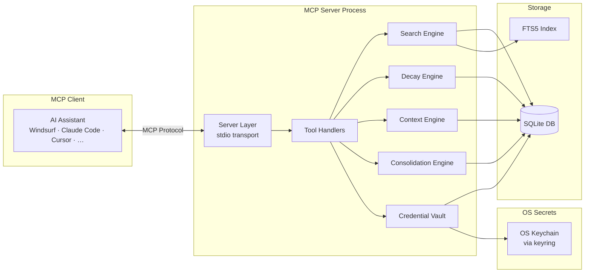

# 🏗️ Architecture — Gingugu

## Overview

Gingugu is a **Python MCP server** using **SQLite + FTS5** for persistent, structured, searchable long-term memory. It runs locally via stdio transport and works with any MCP client — Windsurf, Claude Code, Claude Desktop, Cursor, Cline, and friends.

---

## System Design



---

## Data Model

### Core Tables

#### `namespaces`
```sql
CREATE TABLE namespaces (
    id          TEXT PRIMARY KEY,  -- UUID
    name        TEXT NOT NULL UNIQUE,
    path        TEXT,              -- filesystem path (e.g., repo root)
    description TEXT,
    created_at  TEXT NOT NULL,
    updated_at  TEXT NOT NULL
);
```

#### `memories`
```sql
CREATE TABLE memories (
    id              TEXT PRIMARY KEY,  -- UUID
    namespace_id    TEXT NOT NULL REFERENCES namespaces(id),
    type            TEXT NOT NULL,     -- fact|decision|pattern|bug|architecture|preference|workflow|context
    title           TEXT NOT NULL,
    content         TEXT NOT NULL,
    confidence      TEXT NOT NULL DEFAULT 'inferred',  -- verified|inferred|stale|deprecated
    source          TEXT,             -- where this came from
    created_at      TEXT NOT NULL,
    updated_at      TEXT NOT NULL,
    last_accessed   TEXT NOT NULL,
    last_confirmed  TEXT,
    access_count    INTEGER DEFAULT 0,
    metadata        TEXT              -- JSON blob for flexible extra data
);
```

#### `memories_fts` (FTS5 Virtual Table)
```sql
CREATE VIRTUAL TABLE memories_fts USING fts5(
    title,
    content,
    content=memories,
    content_rowid=rowid,
    tokenize='porter unicode61'
);

-- Required sync triggers (FTS5 contentless-delete pattern)
CREATE TRIGGER memories_ai AFTER INSERT ON memories BEGIN
    INSERT INTO memories_fts(rowid, title, content)
    VALUES (new.rowid, new.title, new.content);
END;

CREATE TRIGGER memories_ad AFTER DELETE ON memories BEGIN
    INSERT INTO memories_fts(memories_fts, rowid, title, content)
    VALUES ('delete', old.rowid, old.title, old.content);
END;

CREATE TRIGGER memories_au AFTER UPDATE ON memories BEGIN
    INSERT INTO memories_fts(memories_fts, rowid, title, content)
    VALUES ('delete', old.rowid, old.title, old.content);
    INSERT INTO memories_fts(rowid, title, content)
    VALUES (new.rowid, new.title, new.content);
END;
```

**`rowid` vs. `id` — read this before writing joins.** `memories.id` is a
`TEXT` UUID, so SQLite maintains a *separate* implicit integer `rowid`. The FTS5
external-content table is bound to that `rowid` (`content_rowid=rowid`), and the
triggers above sync on `new.rowid` / `old.rowid`. Consequences:

- **All FTS joins must be on `rowid`**, never `id`:
  `JOIN memories m ON m.rowid = memories_fts.rowid`.
- **Never run `VACUUM` while FTS is live without a follow-up
  `INSERT INTO memories_fts(memories_fts) VALUES('rebuild')`** — `VACUUM` can
  renumber rowids and desync the index.
- External code/relations reference memories by the stable `id` UUID; only the
  FTS layer uses `rowid`. Keep that boundary inside `search.py`.

#### `tags`
```sql
CREATE TABLE tags (
    id   TEXT PRIMARY KEY,
    name TEXT NOT NULL UNIQUE  -- normalized: lowercase, trimmed, internal whitespace collapsed to single '-'
);
```

**Normalization rule:** tag names are normalized before insert/lookup via
`re.sub(r"\s+", "-", name.strip().lower())`. Callers may pass `"Python Async"`,
storage will see `"python-async"`. This prevents fragmentation across casing
and whitespace variants.

#### `memory_tags`
```sql
CREATE TABLE memory_tags (
    memory_id TEXT NOT NULL REFERENCES memories(id) ON DELETE CASCADE,
    tag_id    TEXT NOT NULL REFERENCES tags(id) ON DELETE CASCADE,
    PRIMARY KEY (memory_id, tag_id)
);
```

#### `relations`
```sql
CREATE TABLE relations (
    id              TEXT PRIMARY KEY,
    source_id       TEXT NOT NULL REFERENCES memories(id) ON DELETE CASCADE,
    target_id       TEXT NOT NULL REFERENCES memories(id) ON DELETE CASCADE,
    relation_type   TEXT NOT NULL,  -- supersedes|related_to|caused_by|contradicts|parent_of|child_of
    created_at      TEXT NOT NULL,
    metadata        TEXT            -- JSON
);
```

#### `access_log`
```sql
CREATE TABLE access_log (
    id          TEXT PRIMARY KEY,
    memory_id   TEXT NOT NULL REFERENCES memories(id) ON DELETE CASCADE,
    accessed_at TEXT NOT NULL,
    context     TEXT  -- what triggered the access
);

CREATE INDEX idx_access_log_memory_time ON access_log(memory_id, accessed_at);
```

**Retention:** `access_log` is pruned to a rolling 90-day window opportunistically
on **both** `memory_stats` calls and write operations (`memory_store` /
`memory_update`), guarded by a cheap throttle (skip if pruned within the last
hour) so it can't grow unbounded when `memory_stats` is rarely called. Aggregate
counts are denormalized onto `memories.access_count`, so trimming the log is
non-destructive to ranking.

---

## Scoring & Memory Lifecycle

Every memory gets a composite **score** in roughly `[0, 1+]` blending lexical
relevance with temporal and trust signals.

**Lifecycle philosophy — a robot brain never forgets.** Time alone never
destroys trust or retrievability. A memory left untouched goes *dormant*
(resting), not *stale* (rotting). Three rules follow from this:

1. **Freshness has a floor** (`0.35`) — it never decays to zero, so a 5-year-old
   verified fact stays retrievable.
2. **Confidence (trust) is the dominant standalone signal** — recency is a
   gentle tiebreaker, not an eraser.
3. **Dormancy is reported, never auto-applied** — nothing ever auto-demotes a
   memory's confidence. Memories are only ever deprecated/deleted by explicit
   `memory_forget`.

### Step 1 — Normalize BM25

SQLite's `bm25()` returns a **negative** score where **more negative = better**
match. We invert and squash to `[0, 1]` so it composes cleanly with the other
factors:

```python
raw = bm25(memories_fts)            # e.g. -8.3 (great) ... -0.1 (weak)
relevance = 1.0 / (1.0 + max(0.0, -raw))   # great → ~0.89, weak → ~0.09
```

For non-search retrieval (e.g. `memory_context`), `relevance` defaults to
`0.5` so freshness/confidence drive ordering.

### Step 2 — Compute the composite

```
score = w_r·relevance + w_f·freshness + w_a·access + w_c·confidence
```

Default weights (sum to 1.0, tunable via env):

| Weight | Default | Env var |
|--------|---------|---------|
| `w_r` (relevance)   | 0.45 | `MEMORY_W_RELEVANCE` |
| `w_f` (freshness)   | 0.10 | `MEMORY_W_FRESHNESS` |
| `w_a` (access)      | 0.10 | `MEMORY_W_ACCESS` |
| `w_c` (confidence)  | 0.35 | `MEMORY_W_CONFIDENCE` |

Confidence carries more weight than freshness by design: *what we trust*
matters more than *what we touched recently*. Dormant-but-verified beats
fresh-but-unverified.

**Normalization:** weights are user-overridable and not guaranteed to sum to
1.0. The config loader **normalizes at load** — each effective weight is
`w_i / Σw` — so a user setting `MEMORY_W_RELEVANCE=0.9` alone still yields a
composite score in the documented range instead of drifting above `1.0`. If
`Σw == 0` (all weights zeroed), the loader falls back to the defaults above and
logs a warning.

### Step 3 — Component formulas

| Component | Formula | Range | Notes |
|-----------|---------|-------|-------|
| `relevance`  | `1 / (1 + |bm25|)` or `0.5` if no query | `[0, 1]` | See Step 1 |
| `freshness`  | `floor + (1-floor)·exp(-λ × days_since_confirmed)` | `[0.35, 1]` | floor `0.35`; λ in **days⁻¹**, default `0.01` |
| `access`     | `min(1.0, log(access_count + 1) / log(50))` | `[0, 1]` | Saturates at ~50 accesses |
| `confidence` | `verified=1.0, inferred=0.7, stale=0.3, deprecated=0.0` | `[0, 1]` | Hard floor at 0 |

**Freshness floor:** `freshness` asymptotes to `FRESHNESS_FLOOR` (0.35), never
zero. Dormancy lowers a memory's recency contribution slightly but can never
push it out of reach — the never-forget guarantee in the scoring math. The
`stale` confidence value is legacy (no longer auto-assigned); existing `stale`
memories keep working.

**`days_since_confirmed` source (null-safe):** `last_confirmed` is nullable —
a freshly stored memory has never been confirmed. The reference timestamp is
always resolved as `COALESCE(last_confirmed, updated_at, created_at)`, so a
brand-new memory scores `freshness ≈ 1.0` (zero days elapsed) rather than
crashing on `NULL` math. `created_at` is `NOT NULL`, guaranteeing a value.

**Confidence ordering** (used by the `confidence` "minimum level" filter on
`memory_recall` / `memory_search`): `verified > inferred > stale > deprecated`.
Passing `confidence=inferred` returns `verified` and `inferred` memories and
excludes `stale` / `deprecated`. The enum is stored as a string but compared
via this fixed rank.

Additive (not multiplicative) so one weak factor can't zero out the score —
except `confidence=deprecated` which the query filters out before scoring.

### Why additive over multiplicative

Multiplying BM25 (negative) by `confidence_weight` flips ranking direction
silently. Multiplying a perfect-recent match by `0.7` (inferred) ranks it
below a mediocre verified match — usually wrong. Additive blending with
normalized components is predictable, tunable, and survives missing factors
(set their weight to 0).

### Lifecycle Rules

| Condition | Action |
|-----------|--------|
| Not accessed in 90 days | Reported as **dormant** (`stats.dormant_count`) — a resting signal, never a confidence change |
| Not confirmed in 180 days | Suggest deprecation (advisory only) |
| Marked `deprecated` | Excluded from search results (unless explicitly requested) |
| Confidence = `verified` + recent access | Boosted to top of results |

> The old "flag as stale after 90 days" auto-demotion was **removed** — it
> contradicted the never-forget model. `memory_stats(flag_stale=…)` is now a
> deprecated, ignored no-op kept for backward compatibility.

### Spreading Activation

Recall is associative. When `memory_recall` or `memory_context` surfaces a set
of memories, each result's **relation neighbours** (1 hop, both directions) are
*reactivated*: their `last_accessed` is refreshed so they leave the dormant
set, **without** incrementing `access_count` or writing an `access_log` row
(a reactivation is not a direct access). This is how a dormant memory wakes when
a *different* memory sparks it — the cluster lights up together. Implemented in
`MemoryStore.touch_many()` and the `_spread_activation` handler helper;
best-effort, so a failure never breaks a read. Tag-based spreading is a planned
follow-up.

---

## MCP Tools Specification

### `memory_store`
Store a new memory with full metadata.

**Parameters:**
- `content` (required) — the knowledge to remember
- `title` (required) — short descriptive title
- `type` (required) — fact|decision|pattern|bug|architecture|preference|workflow|context
- `namespace` (optional) — auto-detected from workspace if not provided
- `tags` (optional) — comma-separated concept tags
- `confidence` (optional) — defaults to `inferred`
- `source` (optional) — where this knowledge came from
- `metadata` (optional) — JSON string of additional data

### `memory_recall`
Search and retrieve memories ranked by relevance × freshness.

**Parameters:**
- `query` (required) — natural language search query
- `namespace` (optional) — scope to specific namespace. An explicit unknown
  namespace is an error (reads never create namespaces); when omitted and the
  config-resolved namespace doesn't exist yet, returns an empty result.
- `type` (optional) — filter by memory type
- `confidence` (optional) — minimum confidence level (rank order: `verified > inferred > stale > deprecated`; see *Confidence ordering* above)
- `limit` (optional) — max results (default 10)
- `include_deprecated` (optional) — also return deprecated memories (stale
  ones are always included; the minimum-confidence filter excludes them)
- `include_related` (optional) — also surface memories directly linked to the
  top hits via relations

### `memory_context`
Auto-surface relevant memories for the current workspace. Called on session start.

**Parameters:**
- `namespace` (optional) — auto-resolved from config when omitted. Created if
  absent (session start in a fresh workspace bootstraps its namespace).
- `task_hint` (optional) — brief description of current task for better relevance
- `limit` (optional) — max memories to surface (defaults to
  `MEMORY_AUTO_CONTEXT_LIMIT`, which defaults to 10)

**Retrieval strategy:** the result set is a *union* of three buckets, then
de-duplicated and sorted by composite score (Step 2 above):

1. **Task-relevant (if `task_hint` provided)** — FTS5 search scoped to
   `namespace`, top `ceil(limit × 0.5)` by composite score.
2. **Recently active in this namespace** — last `limit` memories ordered by
   `last_accessed DESC`, excluding `deprecated`.
3. **Cross-namespace high-confidence patterns** — `type IN ('pattern',
   'preference')` with `confidence='verified'`, top 3 by composite score.
   Lets a pattern learned in repo A surface in repo B.

Final cap at `limit`. Boost weights for types `architecture` and `decision`
by +0.1 to score (they're disproportionately useful for session start).

### `memory_update`
Update an existing memory's content, confidence, or metadata.

**Parameters:**
- `memory_id` (required) — UUID of memory to update
- `content` (optional) — new content
- `title` (optional) — new title
- `confidence` (optional) — new confidence level
- `metadata` (optional) — updated metadata JSON

### `memory_relate`
Create a relationship between two memories.

**Parameters:**
- `source_id` (required) — UUID of source memory
- `target_id` (required) — UUID of target memory
- `relation_type` (required) — supersedes|related_to|caused_by|contradicts|parent_of|child_of

### `memory_consolidate`
Merge or summarize related memories into a single consolidated memory.

**Parameters:**
- `memory_ids` (required) — comma-separated UUIDs to consolidate
- `strategy` (optional) — merge|summarize|deduplicate (default: merge)
- `keep_originals` (optional) — retain originals as deprecated (default: true)

### `memory_forget`
Deprecate or permanently delete a memory.

**Parameters:**
- `memory_id` (required) — UUID of memory
- `hard_delete` (optional) — permanently remove vs. mark deprecated (default: false)
- `reason` (optional) — why this is being forgotten

### `memory_namespaces`
List and manage namespaces.

**Parameters:**
- `action` (required) — list|create|update|delete
- `name` (optional) — namespace name
- `path` (optional) — filesystem path for the namespace
- `description` (optional) — namespace description

### `memory_stats`
Get health overview of the memory system.

**Parameters:**
- `namespace` (optional) — scope to namespace, or global if omitted
- `flag_stale` (optional, **deprecated**) — ignored no-op kept for backward
  compatibility; the old auto-demotion contradicted the never-forget model and
  was removed. Stats report `dormant_count` (a resting signal) instead and
  never mutate confidence.

### `memory_search`
Advanced search with full filter support.

**Parameters:**
- `query` (optional) — text search query
- `namespace` (optional) — namespace filter
- `type` (optional) — memory type filter
- `tags` (optional) — required tags (comma-separated)
- `confidence` (optional) — confidence filter
- `created_after` (optional) — date filter
- `created_before` (optional) — date filter
- `sort_by` (optional) — relevance|created|accessed|decay_score
- `include_deprecated` (optional) — also return deprecated memories
- `limit` (optional) — max results

### `memory_export`
Export memories to a portable JSON payload (backup/transfer). Credentials are
intentionally excluded — their secrets live in the OS keychain.

**Parameters:**
- `namespace` (optional) — scope to one namespace, or export everything
- `include_deprecated` (optional) — include deprecated memories (default true)

### `memory_import`
Import a payload produced by `memory_export`. Namespaces are matched by
*name* (created if missing); tags and relations are restored. Enum values
(`type`, `confidence`, `relation_type`) are validated before any insert.

**Parameters:**
- `data` (required) — the export payload
- `on_conflict` (optional) — `skip` (default) or `replace` for memories
  sharing an id

---

## Credential Vault

A **global, secure credential store** for third-party API secrets (Jira, AWS,
GitHub, Datadog, GitLab, etc.). Credentials are organized as **service bundles**
— each service holds a set of named fields, some secret, some plain.

**Key properties:**
- **Fully isolated** from the memory system — no decay, no FTS indexing, no
  auto-context surfacing. Credentials never appear in `memory_recall`,
  `memory_context`, or `memory_search` results.
- **Global scope** — all credentials are available across every namespace.
- **OS-native secret storage** — secret field values live in the **OS
  keychain** (macOS Keychain, Windows Credential Locker, Linux Secret
  Service — via Python's `keyring` library), not in SQLite. SQLite only
  stores metadata and non-secret field values.
- **Expiry awareness** — optional `expires_at` per service, surfaced in
  `credential_list` and `memory_stats`.

### Credential Tables

#### `credential_services`
```sql
CREATE TABLE credential_services (
    id           TEXT PRIMARY KEY,  -- UUID
    service_name TEXT NOT NULL UNIQUE,  -- e.g., 'jira', 'github', 'aws-prod'
    description  TEXT,
    created_at   TEXT NOT NULL,
    updated_at   TEXT NOT NULL,
    expires_at   TEXT              -- ISO-8601 expiry date (nullable)
);
```

#### `credential_fields`
```sql
CREATE TABLE credential_fields (
    id           TEXT PRIMARY KEY,  -- UUID
    service_id   TEXT NOT NULL REFERENCES credential_services(id) ON DELETE CASCADE,
    field_name   TEXT NOT NULL,     -- e.g., 'api_token', 'base_url', 'username'
    is_secret    INTEGER NOT NULL DEFAULT 1,  -- 1 = value in Keychain, 0 = value in plain_value
    plain_value  TEXT,              -- only populated when is_secret = 0
    created_at   TEXT NOT NULL,
    updated_at   TEXT NOT NULL,
    UNIQUE(service_id, field_name)
);
```

### Secret Storage via Keychain

Secret field values are stored in the OS keychain, **never** in SQLite.

- **Keychain service name:** `gingugu`
- **Keychain account key:** `{service_name}/{field_name}` (e.g., `jira/api_token`)
- **Library:** [`keyring`](https://pypi.org/project/keyring/) — abstracts
  macOS Keychain, Linux Secret Service, and Windows Credential Locker.

```python
import keyring

# Store
keyring.set_password("gingugu", "jira/api_token", "sk-abc123...")

# Retrieve
value = keyring.get_password("gingugu", "jira/api_token")

# Delete
keyring.delete_password("gingugu", "jira/api_token")
```

### Why `is_secret` matters

A Jira bundle might contain `base_url` (not secret), `username` (gray area),
and `api_token` (definitely secret). Storing URLs in Keychain is wasteful and
makes `credential_list` useless — you can't see what services you have without
hitting Keychain. With `is_secret`:

- **`credential_list`** shows service names + non-secret fields (URLs,
  usernames) without touching Keychain.
- **`credential_get`** pulls everything — secret values from Keychain on demand.
- **Default: `is_secret=true`** for safety. Fields are assumed secret unless
  explicitly marked otherwise.

### Credential MCP Tools

#### `credential_store`
Create or update a service bundle.

**Parameters:**
- `service_name` (required) — identifier (e.g., `jira`, `aws-prod`, `github`)
- `description` (optional) — human-readable description
- `fields` (required) — JSON object:
  ```json
  {
    "base_url": { "value": "https://myorg.atlassian.net", "is_secret": false },
    "username": { "value": "jdoe@example.com", "is_secret": false },
    "api_token": { "value": "sk-abc123..." }
  }
  ```
  `is_secret` defaults to `true` if omitted.
- `expires_at` (optional) — ISO-8601 date string for credential expiry

**Behavior on update:** if the service already exists, fields are upserted.
Existing fields not in the new payload are untouched. To remove a field, use
`credential_delete` with `field_name`.

#### `credential_get`
Retrieve a full service bundle, including secret values from Keychain.

**Parameters:**
- `service_name` (required) — which service to retrieve
- `fields` (optional) — comma-separated field names to return (default: all)

**Returns:** JSON with service metadata + all requested fields and their values.

#### `credential_list`
List all services with metadata and non-secret field values. **Does not hit
Keychain** — safe and fast for overview.

**Parameters:**
- `check_expiry` (optional, default: `true`) — flag each service as `active`,
  `expiring_soon` (within 14 days), or `expired`

#### `credential_delete`
Remove a service bundle or a specific field. Cleans up Keychain entries.

**Parameters:**
- `service_name` (required) — which service
- `field_name` (optional) — delete a single field instead of the whole service
- `confirm` (required) — must be `true` (safety catch against accidental deletion)

### Expiry Behavior

- `credential_list` with `check_expiry=true` computes status per service:
  - **`active`** — no `expires_at` set, or expiry is >14 days away
  - **`expiring_soon`** — expiry within 14 days
  - **`expired`** — past the `expires_at` date
- `memory_stats` includes a **credential health summary**: total count,
  expired count, expiring-soon count.
- Expired credentials **still return values** — the system warns, it doesn't
  block. Rotation is the user's responsibility.

---

## Namespace Auto-Detection

MCP stdio doesn't expose the client's workspace path through the protocol.
Resolution order (first hit wins):

1. **Explicit `namespace` parameter** on the tool call
2. **`MEMORY_NAMESPACE` env var** set in the MCP server's `env` block (per-workspace `mcp_config.json`)
3. **`MEMORY_NAMESPACE_PATH` env var** — filesystem path; namespace name derived from `basename`
4. **Fallback to `default`** namespace, with a warning logged

**Recommended setup:** your MCP client's server entry sets
`MEMORY_NAMESPACE` to the repo name (per-workspace where the client supports
it). See README for an example.

---

## Schema Migrations

Hand-rolled, keyed off `PRAGMA user_version`. No Alembic, no external tooling
— overkill for a single-file DB.

```python
# database.py
MIGRATIONS = [
    # (target_version, sql_or_callable)
    (1, _migration_001_initial_schema),
    (2, _migration_002_add_some_column),
]

def migrate(conn):
    current = conn.execute("PRAGMA user_version").fetchone()[0]
    for target, fn in MIGRATIONS:
        if current < target:
            fn(conn)
            conn.execute(f"PRAGMA user_version = {target}")
            conn.commit()
```

**Rules:**
- Migrations are **additive by default** — adding columns/tables/indexes is fine
- **Destructive migrations** (drop column, change type) require explicit user approval and a pre-migration backup of the DB file to `memories.db.bak-{version}`
- WAL mode (`PRAGMA journal_mode=WAL`) is enabled on every connection open
- Foreign keys enforced (`PRAGMA foreign_keys=ON`)

---

## Module Structure

```
src/gingugu/
├── __init__.py           # Package init + version
├── server.py             # MCP server setup + tool registration
├── handlers/             # Tool handler implementations (split to honor 300-line limit)
│   ├── __init__.py       # Handler registry / dispatch table
│   ├── memory.py         # store, recall, update, forget, context
│   ├── search.py         # search, stats
│   ├── relations.py      # relate, consolidate
│   ├── namespaces.py     # namespaces
│   └── credentials.py    # credential_store/get/list/delete
├── models.py             # Pydantic models / data schemas
├── database.py           # SQLite connection, migrations, FTS5 setup
├── storage.py            # CRUD operations for memories
├── search.py             # FTS5 search + BM25 ranking
├── relations.py          # Relationship management
├── decay.py              # Decay scoring + staleness detection
├── consolidation.py      # Merge/summarize/deduplicate logic
├── context.py            # Auto-context generation for session start
├── namespaces.py         # Namespace CRUD + auto-detection
└── credentials.py        # Credential vault: CRUD + keyring integration
```

---

## Design Principles

1. **Local-first** — no network calls, no cloud, no API keys
2. **Zero-config** — works out of the box with sensible defaults
3. **Fast** — SQLite + FTS5 handles millions of rows on commodity hardware
4. **Portable** — single DB file, easy to backup/move/sync
5. **Extensible** — can bolt on embeddings, vector search, or LLM-powered consolidation later
6. **Trustworthy** — confidence tracking means you know what's solid vs. what's fuzzy
7. **Secure** — credentials stored in OS-native keychain, never in plaintext SQLite

---

## Future Enhancements (v2+)

- **Local embeddings** via `sentence-transformers` for semantic search
- **LLM-powered consolidation** — use the AI itself to summarize memory clusters
- **Rules integration** — auto-generate rules files (`.windsurfrules`, `.cursorrules`, `AGENTS.md`) from learned patterns
- **Multi-agent support** — shared memory across different AI tools
