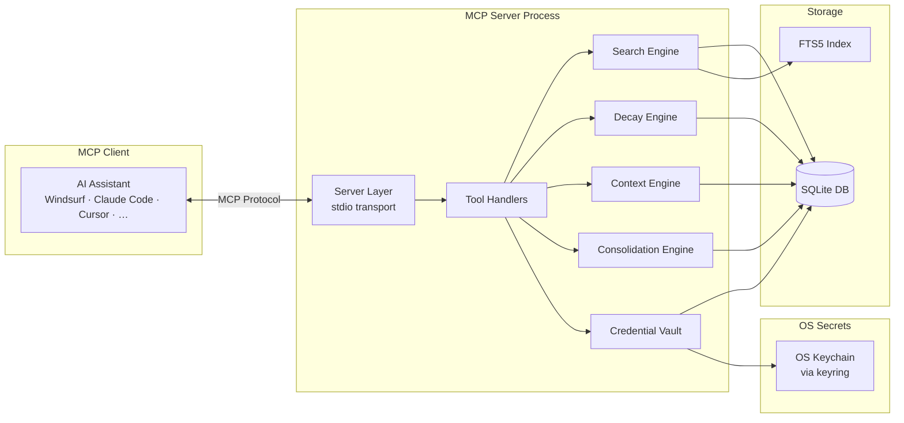

# 🏗️ Architecture — Gingugu

## Overview

Gingugu is a **Python MCP server** using **SQLite + FTS5** for persistent, structured, searchable long-term memory. It runs locally via stdio transport and works with any MCP client — Windsurf, Claude Code, Claude Desktop, Cursor, Cline, and friends.

---

## System Design


```mermaid
graph LR
    subgraph MCP Client
        A[AI Assistant<br/>Windsurf · Claude Code · Cursor · …]
    end

    subgraph MCP Server Process
        B[Server Layer<br/>stdio transport]
        C[Tool Handlers]
        D[Search Engine]
        E[Decay Engine]
        F[Context Engine]
        G[Consolidation Engine]
        K[Credential Vault]
    end

    subgraph Storage
        H[(SQLite DB)]
        I[FTS5 Index]
    end

    subgraph OS Secrets
        J[OS Keychain<br/>via keyring]
    end

    A <-->|MCP Protocol| B
    B --> C
    C --> D
    C --> E
    C --> F
    C --> G
    C --> K
    D --> H
    D --> I
    E --> H
    F --> H
    G --> H
    K --> H
    K --> J
```

---

## Data Model

### Core Tables

#### `namespaces`
```sql
CREATE TABLE namespaces (
    id          TEXT PRIMARY KEY,  -- UUID
    name        TEXT NOT NULL UNIQUE,
    path        TEXT,              -- filesystem path (e.g., repo root)
    description TEXT,
    created_at  TEXT NOT NULL,
    updated_at  TEXT NOT NULL
);
```

#### `memories`
```sql
CREATE TABLE memories (
    id              TEXT PRIMARY KEY,  -- UUID
    namespace_id    TEXT NOT NULL REFERENCES namespaces(id),
    type            TEXT NOT NULL,     -- fact|decision|pattern|bug|architecture|preference|workflow|context
    title           TEXT NOT NULL,
    content         TEXT NOT NULL,
    confidence      TEXT NOT NULL DEFAULT 'inferred',  -- verified|inferred|stale|deprecated
    source          TEXT,             -- where this came from
    created_at      TEXT NOT NULL,
    updated_at      TEXT NOT NULL,
    last_accessed   TEXT NOT NULL,
    last_confirmed  TEXT,
    access_count    INTEGER DEFAULT 0,
    metadata        TEXT,             -- JSON blob for flexible extra data
    pinned          INTEGER NOT NULL DEFAULT 0  -- always load in memory_context, exempt from ranking
);

-- Partial index: only ever indexes the handful of pinned rows, so the
-- context-load lookup stays cheap regardless of table size.
CREATE INDEX idx_memories_pinned ON memories(namespace_id, pinned) WHERE pinned = 1;
```

#### `memories_fts` (FTS5 Virtual Table)
```sql
CREATE VIRTUAL TABLE memories_fts USING fts5(
    title,
    content,
    content=memories,
    content_rowid=rowid,
    tokenize='porter unicode61'
);

-- Required sync triggers (FTS5 contentless-delete pattern)
CREATE TRIGGER memories_ai AFTER INSERT ON memories BEGIN
    INSERT INTO memories_fts(rowid, title, content)
    VALUES (new.rowid, new.title, new.content);
END;

CREATE TRIGGER memories_ad AFTER DELETE ON memories BEGIN
    INSERT INTO memories_fts(memories_fts, rowid, title, content)
    VALUES ('delete', old.rowid, old.title, old.content);
END;

CREATE TRIGGER memories_au AFTER UPDATE ON memories BEGIN
    INSERT INTO memories_fts(memories_fts, rowid, title, content)
    VALUES ('delete', old.rowid, old.title, old.content);
    INSERT INTO memories_fts(rowid, title, content)
    VALUES (new.rowid, new.title, new.content);
END;
```

**`rowid` vs. `id` — read this before writing joins.** `memories.id` is a
`TEXT` UUID, so SQLite maintains a *separate* implicit integer `rowid`. The FTS5
external-content table is bound to that `rowid` (`content_rowid=rowid`), and the
triggers above sync on `new.rowid` / `old.rowid`. Consequences:

- **All FTS joins must be on `rowid`**, never `id`:
  `JOIN memories m ON m.rowid = memories_fts.rowid`.
- **Never run `VACUUM` while FTS is live without a follow-up
  `INSERT INTO memories_fts(memories_fts) VALUES('rebuild')`** — `VACUUM` can
  renumber rowids and desync the index.
- External code/relations reference memories by the stable `id` UUID; only the
  FTS layer uses `rowid`. Keep that boundary inside `search.py`.

#### `tags`
```sql
CREATE TABLE tags (
    id   TEXT PRIMARY KEY,
    name TEXT NOT NULL UNIQUE  -- normalized: lowercase, trimmed, internal whitespace collapsed to single '-'
);
```

**Normalization rule:** tag names are normalized before insert/lookup via
`re.sub(r"\s+", "-", name.strip().lower())`. Callers may pass `"Python Async"`,
storage will see `"python-async"`. This prevents fragmentation across casing
and whitespace variants.

#### `memory_tags`
```sql
CREATE TABLE memory_tags (
    memory_id TEXT NOT NULL REFERENCES memories(id) ON DELETE CASCADE,
    tag_id    TEXT NOT NULL REFERENCES tags(id) ON DELETE CASCADE,
    PRIMARY KEY (memory_id, tag_id)
);
```

#### `relations`
```sql
CREATE TABLE relations (
    id              TEXT PRIMARY KEY,
    source_id       TEXT NOT NULL REFERENCES memories(id) ON DELETE CASCADE,
    target_id       TEXT NOT NULL REFERENCES memories(id) ON DELETE CASCADE,
    relation_type   TEXT NOT NULL,  -- supersedes|related_to|caused_by|contradicts|parent_of|child_of
    created_at      TEXT NOT NULL,
    metadata        TEXT            -- JSON
);
```

#### `access_log`
```sql
CREATE TABLE access_log (
    id          TEXT PRIMARY KEY,
    memory_id   TEXT NOT NULL REFERENCES memories(id) ON DELETE CASCADE,
    accessed_at TEXT NOT NULL,
    context     TEXT  -- what triggered the access
);

CREATE INDEX idx_access_log_memory_time ON access_log(memory_id, accessed_at);
```

**Retention:** `access_log` is pruned to a rolling 90-day window opportunistically
on **both** `memory_stats` calls and write operations (`memory_store` /
`memory_update`), guarded by a cheap throttle (skip if pruned within the last
hour) so it can't grow unbounded when `memory_stats` is rarely called. Aggregate
counts are denormalized onto `memories.access_count`, so trimming the log is
non-destructive to ranking.

---

## Scoring & Memory Lifecycle

Every memory gets a composite **score** in roughly `[0, 1+]` blending lexical
relevance with temporal and trust signals.

**Lifecycle philosophy — a robot brain never forgets.** Time alone never
destroys trust or retrievability. A memory left untouched goes *dormant*
(resting), not *stale* (rotting). Three rules follow from this:

1. **Freshness has a floor** (`0.35`) — it never decays to zero, so a 5-year-old
   verified fact stays retrievable.
2. **Confidence (trust) is the dominant standalone signal** — recency is a
   gentle tiebreaker, not an eraser.
3. **Dormancy is reported, never auto-applied** — nothing ever auto-demotes a
   memory's confidence. Memories are only ever deprecated/deleted by explicit
   `memory_forget`.

### Step 1 — Hybrid relevance (BM25 ⊕ semantic, RRF-fused)

Two candidate pools are pulled **independently** for a query:

- **Lexical:** FTS5 BM25, top `4 × limit` candidates.
- **Semantic:** cosine similarity over stored embeddings for the same
  filtered corpus. Every BM25 candidate with an embedding keeps a semantic
  rank (never displaced), and up to `limit / 2` additional memories with
  **no** BM25 match join when their similarity clears a `0.55` floor — so a
  memory matching the query's *meaning* surfaces even when it shares no
  keywords with it, while weak lookalikes can't crowd out keyword matches.
  Both knobs are tuned against the retrieval benchmark (`bench/`).

The two rankings are fused with **Reciprocal Rank Fusion** (`k = 60`) over
their union and normalized to `[0, 1]` — rank 1 in both pools maps to `1.0`.
Rank-based fusion avoids the score-compression problem of normalizing raw
BM25 values. Without embeddings, relevance falls back to rank-based BM25
alone.

For non-search retrieval (e.g. `memory_context`), `relevance` defaults to
`0.5` so freshness/confidence drive ordering.

### Step 2 — Compute the composite

```
score = w_r·relevance + w_f·freshness + w_a·access + w_c·confidence
```

Each read surface can return those four terms alongside the blended number.
`memory_recall`, `memory_search` and `memory_context` take `explain=True` and
add a `score_breakdown` per hit: the **weighted** contributions, so they sum to
`score` and a caller can see which signal produced a result without knowing the
configured weights. `memory_context` adds a `type_boost` term wherever the
architecture/decision boost applied.

The score is summed from the breakdown rather than computed beside it
(`composite_score` = `sum(composite_parts(...))`), so the two cannot drift. A
result with no composite behind it carries no breakdown: pinned memories never
entered the ranking, an `ids` fetch was not ranked, and a bare fused relevance
has nothing to decompose.

Default weights (sum to 1.0, tunable via env):

| Weight | Default | Env var |
|--------|---------|---------|
| `w_r` (relevance)   | 0.45 | `MEMORY_W_RELEVANCE` |
| `w_f` (freshness)   | 0.10 | `MEMORY_W_FRESHNESS` |
| `w_a` (access)      | 0.10 | `MEMORY_W_ACCESS` |
| `w_c` (confidence)  | 0.35 | `MEMORY_W_CONFIDENCE` |

Confidence carries more weight than freshness by design: *what we trust*
matters more than *what we touched recently*. Dormant-but-verified beats
fresh-but-unverified.

**Normalization:** weights are user-overridable and not guaranteed to sum to
1.0. The config loader **normalizes at load** — each effective weight is
`w_i / Σw` — so a user setting `MEMORY_W_RELEVANCE=0.9` alone still yields a
composite score in the documented range instead of drifting above `1.0`. If
`Σw == 0` (all weights zeroed), the loader falls back to the defaults above and
logs a warning.

### Step 3 — Component formulas

| Component | Formula | Range | Notes |
|-----------|---------|-------|-------|
| `relevance`  | RRF-fused hybrid rank, or `0.5` if no query | `[0, 1]` | See Step 1 |
| `freshness`  | `floor + (1-floor)·exp(-λ × days_since_confirmed)` | `[0.35, 1]` | floor `0.35`; λ in **days⁻¹**, default `0.01` |
| `access`     | `min(1.0, log(access_count + 1) / log(50))` | `[0, 1]` | Saturates at ~50 accesses |
| `confidence` | `verified=1.0, inferred=0.7, stale=0.3, deprecated=0.0` | `[0, 1]` | Hard floor at 0 |

**Freshness floor:** `freshness` asymptotes to `FRESHNESS_FLOOR` (0.35), never
zero. Dormancy lowers a memory's recency contribution slightly but can never
push it out of reach — the never-forget guarantee in the scoring math. The
`stale` confidence value is legacy (no longer auto-assigned); existing `stale`
memories keep working.

**`days_since_confirmed` source (null-safe):** `last_confirmed` is nullable —
a freshly stored memory has never been confirmed. The reference timestamp is
always resolved as the **latest** of `last_confirmed`, `updated_at` and
`created_at`, so a brand-new memory scores `freshness ≈ 1.0` (zero days
elapsed) rather than crashing on `NULL` math. `created_at` is `NOT NULL`,
guaranteeing a value.

This anchor is a `MAX`, not a `COALESCE`. A `COALESCE` returns the first
non-null, so a content edit made *after* the last confirmation was discarded
and the memory got scored, spread-sorted and staleness-checked off the older
instant. The same rule applies in SQL (`relations.py`, `stats.py`), where only
`last_confirmed` needs a null guard because the other two columns are
`NOT NULL`.

**A rewrite is a confirmation.** `memory_update` advances `last_confirmed`
whenever `title` or `content` actually changed — someone re-read the claim and
restated it. Tag-only, retype-only, confidence-only and metadata-only edits
assert nothing about truth and leave the clock alone (the same "did the
matching surface move?" test that gates relation hints). Without this, routine
content maintenance never registered and the freshness signal silently rotted.
Accepted trade: a one-word typo fix also resets the staleness clock,
suppressing `review_hints` and `suggests_deprecation` for that memory.

**Confidence ordering** (used by the `confidence` "minimum level" filter on
`memory_recall` / `memory_search`): `verified > inferred > stale > deprecated`.
Passing `confidence=inferred` returns `verified` and `inferred` memories and
excludes `stale` / `deprecated`. The enum is stored as a string but compared
via this fixed rank.

Additive (not multiplicative) so one weak factor can't zero out the score —
except `confidence=deprecated` which the query filters out before scoring.

### Why additive over multiplicative

Multiplying BM25 (negative) by `confidence_weight` flips ranking direction
silently. Multiplying a perfect-recent match by `0.7` (inferred) ranks it
below a mediocre verified match — usually wrong. Additive blending with
normalized components is predictable, tunable, and survives missing factors
(set their weight to 0).

### Lifecycle Rules

| Condition | Action |
|-----------|--------|
| Not accessed in 90 days | Reported as **dormant** (`stats.dormant_count`) — a resting signal, never a confidence change |
| Not confirmed in 180 days | Suggest deprecation (advisory only) |
| Marked `deprecated` | Excluded from search results (unless explicitly requested) |
| Confidence = `verified` + recent access | Boosted to top of results |

> The old "flag as stale after 90 days" auto-demotion was **removed** — it
> contradicted the never-forget model. `memory_stats(flag_stale=…)` is now a
> deprecated, ignored no-op kept for backward compatibility.

### Spreading Activation

Recall is associative. When `memory_recall` or `memory_context` surfaces a set
of memories, each result's **relation neighbours** (1 hop, both directions) are
*reactivated*: their `last_accessed` is refreshed so they leave the dormant
set, **without** incrementing `access_count` or writing an `access_log` row
(a reactivation is not a direct access). This is how a dormant memory wakes when
a *different* memory sparks it — the cluster lights up together. Implemented in
`MemoryStore.touch_many()` and the `_spread_activation` handler helper;
best-effort, so a failure never breaks a read. Tag-based spreading is a planned
follow-up.

**Which neighbours.** A seed's whole cluster is not surfaced — one
highly-connected memory would otherwise drag its entire neighbourhood into
every recall. `RelationManager.dampened_neighbour_ids` picks at most
`SPREAD_PER_SEED` (3) per seed and `SPREAD_TOTAL` (10) overall, filling in seed
order so the best-ranked seeds' clusters win. Candidates are grouped per
**neighbour**, not per edge — two memories may be joined by several edges, and
the pair is scored by its strongest — then ranked by:

1. **confidence rank** (desc)
2. **relation weight** — every directional type outranks the `related_to`
   fallback (`models.RELATION_WEIGHT`)
3. **low relation degree** — a focused memory carries more specific signal than
   a generic hub
4. **recency**, then **id** for full determinism

Confidence sits above relation weight on purpose: `supersedes` habitually
points at the deprecated memory it replaced, so ranking type first would turn
every such edge into a channel for surfacing exactly what the graph records as
no longer true. The weight table is two tiers rather than six because nothing
measured ranks `supersedes` above `caused_by`.

The same dampened set is what surfaces as `via_relation` extras when
`include_related=True`, so the payload and the reactivation never disagree.

### Review Hints

Never-forget means nothing is auto-demoted - but a **point-in-time** memory
("PR #947 open, waiting on Joe"; "key expires 2026-06-29") goes silently wrong
the moment the world moves on. `staleness.py` detects such content and nudges
the *reader* to reconcile it; the server never mutates anything.

Two signal classes (all regex-based, case-insensitive):

- **Gated** - in-flight phrasing that only fires once the memory hasn't been
  confirmed for `REVIEW_HINT_AFTER_DAYS` (14): `open-pr-reference` (a PR/MR
  number near open/waiting/pending/unmerged wording, either order),
  `waiting-on` (waiting on/for, awaiting, blocked on/by), `unmerged-branch`.
  Gated signals never fire on the timeless types (`pattern`, `preference`) -
  a pattern saying "apps blocked on disk I/O" is reference material, not a
  status note.
- **Ungated** - the content names its own clock: `expired-date`
  (`expires <YYYY-MM-DD>` in the past), `stale-as-of-date`
  (`as of <YYYY-MM-DD>` older than the gate window). These apply on every
  type, but are suppressed when `last_confirmed` postdates the named date -
  a reconfirmation after the fact means the outcome is already in the body.

Three filters keep the detector off ordinary prose. They exist because the
signals are text patterns, and the same words occur in writing that describes
a mechanism rather than asserting a status:

- **Nothing counts inside quotes or backticks.** A memory citing
  `"expire 2026-06-29"` is describing the phrase, not claiming the state.
  Only `"` and `` ` `` delimit - a bare `'` is far more often a possessive
  ("Boomtastic's") or a contraction ("PR'd") than a quote.
- **`waiting-on` additionally requires a named agent** within 60 characters:
  a person, a PR/MR reference, a ticket key, or a named artifact (key,
  sign-off, approval). "waiting for EOF" and "waiting for the init container
  image pull" name none of these. The other gated signals carry their own
  subject - a PR number, a branch - so they need only the quoting filter.
- **Deprecated memories are skipped on every surface.** A deprecation *is*
  the reconciliation, so re-flagging it asks for work already done.

The cost of these filters is real and bounded: a wait on an unnamed lowercase
noun ("waiting on the vendor") no longer fires. Measured against a live
751-memory corpus the trade moved precision from 0.65 to 0.79.

Surfaced in two places: each `memory_context` result may carry
`review_hints: [...]`, and `memory_stats` returns a `review` block
(`review_suggested` count + a sample of entries, 5 by default) for a
namespace-wide audit. For a full reconciliation sweep, raise the sample cap
with `memory_stats(review_limit=…)` and pull the flagged bodies with
`memory_search(ids=…)`. The expected reaction is `memory_update` (reconfirm
or correct) or `memory_forget` - the caller's judgment, never the server's.

### State Claims

Review hints are a heuristic over prose. **State claims** are the structural
version, and they answer a different question: not "does this look stale?" but
"has this specific assertion been resolved?"

A memory saying "PR #10 is open" makes a *claim*. It was true when written, so
the prose is honest history and must never be edited to track the world moving
on. `claims.py` extracts the claim into `memory_claims` (migration 005) where
`state` records what the memory **asserts** and never changes; resolution lands
in `resolved_state` / `resolved_by` / `resolved_at` beside it.

That separation is the point. Without it, the only way to record "PR #10 has
since merged" was to rewrite the memory or bolt on a `=== STATUS ===` banner -
and the dogfooding corpus grew **160 distinct banner styles across 37 memories**
because the primitive was missing.

Three things the extractor has to get right, all measured against a live corpus
before the code was written:

- **Refs are not globally unique.** `gingugu#12` and `VersatermTechPlatform#12`
  are different objects, and memories routinely cite another repo's PRs.
  Qualification is URL, then a repo named beside the ref, then the namespace's
  `default_repo`. Unqualifiable refs are dropped rather than guessed. That
  namespace default is load-bearing: in-text qualification alone yields 26
  claims and **zero** usable contradictions, versus 145 and 10 with it - people
  write "PR #20" in their own repo's namespace. Contradiction detection is
  namespace-scoped so a bare-ref mis-key cannot leak across namespaces.

  But not every namespace is a repo. An identity or notes namespace would key
  a bare ref to `crow#32`, a repo that cannot exist - 20 such claims in the
  reference corpus. `memory_namespaces(default_repo="")` declares a namespace
  non-repo so its bare refs are dropped; `crow` and `default` are seeded that
  way by migration 007.
- **A citation is not an assertion.** `[[PR #10 open: the promotion bridge]]`
  is a link to a memory *named* that, not this memory's claim about PR #10 -
  and titles are exactly where "PR #N open" phrasing lives, so any memory
  linking to a claim-bearing memory inherited its claim. Measured: 11 wrong
  claims, **8 of them in a namespace whose default repo was correct**, so
  namespace scoping never contained this one. Wiki-link spans are blanked
  before extraction, length-preservingly so no other ref's state window
  shifts. Nothing is lost - when a claim's only state evidence sits inside a
  link, the linked memory already holds that claim, correctly keyed.
- **State is not a clean binary.** "merge HELD" holds both words; "doc shipped
  PR #168" means *created* while "PR #65 SHIPPED" means *merged*. `shipped` and
  `superseded` are therefore excluded from the resolved vocabulary, and negation
  lookbehinds stop "NOT merged yet" from reading as resolved - which would
  invert the claim, the worst available failure. Nothing counts inside quotes or
  backticks: a memory citing `"PR #30 open"` is describing the phrase.

**The write-time hook.** `memory_store` / `memory_update` return
`contradicted_memories` when the write resolves a ref another memory still calls
open. That is the cheapest moment to reconcile - the caller is already thinking
about that exact PR - and it needs no sweep and no protocol. The key is omitted
rather than empty when there is nothing to report, so the hint stays cheap to
ignore. Extraction is best-effort throughout: a failure logs and is swallowed,
never breaking a write.

**The reconciliation loop:**

```text
memory_stats(review_limit=100)     -> claims { open, open_actionable, resolved,
                                               unverified, contradicted, sample[] }
memory_search(claims="open")       -> the backlog with full bodies
memory_search(claims="unverified") -> refs named but never resolved in prose
memory_update(resolve_claims="…")  -> resolution recorded, PROSE UNTOUCHED
```

`claims.sample` enumerates the backlog, contradicted entries first, each tagged
`contradicted` so priority survives the trip. Two counts, deliberately: `open`
is every unresolved claim, `open_actionable` excludes those on deprecated
memories - which is the set `sample` lists. Reporting only the first invites a
caller to compare it against `len(sample)` and conclude rows went missing.

The sample deliberately did **not** enumerate at first: it listed the
contradicted subset alone, on the reasoning that a contradiction is the only
*machine-answerable* entry. That reasoning was sound and the result was still
unusable - a namespace could report five open claims and offer no way to learn
which five, so a real sweep had to query SQLite by hand. A count without an
enumeration is a dead end wearing a metric's clothes.

A ref whose prose asserts no state records as `unverified` rather than being
dropped. Dropping made it invisible: a memory listing `PR #1:` beside its own
URL under "Deliverables" read as in-flight to a human forever while
`claims.open` said 0. Calling it open instead was measured against the live
corpus and rejected - 185 such claims against 223 real ones, nearly all
narrating work that had already shipped - so it is excluded from `open`,
`open_actionable`, `sample`, and contradiction detection, and read through its
own filter. Same rule as everywhere else here: a missed claim is silent, a
wrong one teaches the reader to ignore claims entirely. `resolve_claims="all"`
stays open-only for that reason; naming the ref explicitly still resolves it.

`memory_search(claims="open"|"contradicted"|"unverified")` is the same predicate
as a search filter, composing with query, type, namespace, and tags. Both consumers share
one correlated subquery in `claim_queries.py`; two hand-written copies is how
they drift. Contradiction remains scoped **within** a namespace, for the same
reason bare refs are: `PR #12` keys off the namespace's default repo, so
matching across namespaces would pair two different repos' PR #12. A missed
contradiction is silent; a fabricated one teaches the reader to ignore the
metric.

---

## MCP Tools Specification

### `memory_store`
Store a new memory with full metadata.

**Parameters:**
- `content` (required) — the knowledge to remember
- `title` (required) — short descriptive title
- `type` (required) — fact|decision|pattern|bug|architecture|preference|workflow|context
- `namespace` (optional) — auto-detected from workspace if not provided
- `tags` (optional) — comma-separated concept tags
- `confidence` (optional) — defaults to `inferred`
- `source` (optional) — where this knowledge came from
- `metadata` (optional) — JSON string of additional data
- `dedupe_check` (optional, default `true`) — also return `similar_memories`,
  a non-blocking hint of up to 3 near-duplicates (score ≥ 0.5) in the same
  namespace; disable for bulk imports
- `relation_check` (optional, default `true`) — also return
  `suggested_relations`, a non-blocking hint of up to 3 memories with moderate
  topical overlap (score ≥ 0.3) that aren't already related, worth examining for
  a directional relationship; disable for bulk imports

**Hint bands.** `similar_memories` flags merge candidates (high overlap).
`suggested_relations` surfaces memories worth *examining* for a relationship
(moderate overlap, with already-related and already-similar memories filtered
out). The two lists are always disjoint — a high-overlap match goes to
`similar_memories`.

`suggested_relations` is not a list of edges to create. Overlap is how a
candidate is found; what justifies an edge is something search cannot infer —
whether this memory `supersedes`, `contradicts`, was `caused_by`, or belongs
under one of them. See [`memory_relate`](#memory_relate) for why a
similarity-only edge is a net loss.

**Hint payloads are always compact** — each entry is `id`, `type`, `title`,
`confidence`, `tags`, `age`, `score`, and a ~200-char `summary`, never full
`content`.
There is no flag to inflate them. Hints are extras the caller did not ask for,
attached to a write; a store could otherwise return six complete memories and
cost more context than the memory being saved. Fetch a candidate's body with
`memory_recall` when it warrants one. The `memory` object in the same response
is *not* compacted — that is the payload the caller asked for.

### `memory_recall`
Search and retrieve memories ranked by relevance × freshness.

**Parameters:**
- `query` (required) — natural language search query
- `namespace` (optional) — a single name **or a comma-separated list**
  (e.g. `"crow,my-project"`) searched in one ranked pass. Unlike
  `memory_context`, `limit` caps the **total** merged result list, not each
  namespace. A multi-namespace response carries `namespaces` (the resolved
  list) instead of the historical `namespace` key; every returned memory is
  stamped with its home `namespace` name either way. Any explicit unknown
  namespace is an error naming the missing one(s) (reads never create
  namespaces); when omitted and the config-resolved namespace doesn't exist
  yet, returns an empty result.
- `type` (optional) — filter by memory type
- `confidence` (optional) — minimum confidence level (rank order: `verified > inferred > stale > deprecated`; see *Confidence ordering* above)
- `limit` (optional) — max results (default 10)
- `include_deprecated` (optional) — also return deprecated memories (stale
  ones are always included; the minimum-confidence filter excludes them)
- `include_related` (optional) — also surface memories directly linked to the
  top hits via relations
- `compact` (optional, default `false`) - same lightweight payload as
  `memory_context`'s compact mode: full `content` replaced by a ~200-char
  `summary` excerpt, bookkeeping fields dropped, `include_related` extras
  compacted too. Use for broad exploratory queries that would otherwise
  exceed MCP clients' tool-result token budgets; compact recalls still
  credit access.

### `memory_context`
Auto-surface relevant memories for the current workspace. Called on session start.

**Parameters:**
- `namespace` (optional) - a single name **or a comma-separated list**
  (e.g. `"crow,my-project"`). Auto-resolved from config when omitted. Created
  if absent (session start in a fresh workspace bootstraps its namespace).
  A multi-namespace call loads every namespace in one shot and
  **de-duplicates across them** - a memory that surfaces in more than one
  load (typically via the cross-namespace pattern bucket) keeps its
  highest-scoring instance. The response carries `namespaces` (the resolved
  list) and `duplicates_removed`; a single-namespace call keeps the
  historical `namespace` key. Every returned memory is stamped with its home
  `namespace` name.
- `task_hint` (optional) — brief description of current task for better relevance
- `limit` (optional) - max memories to surface **per namespace** (defaults to
  `MEMORY_AUTO_CONTEXT_LIMIT`, which defaults to 10)
- `compact` (optional, default `false`) - return a lightweight payload:
  full `content` is replaced by a whitespace-normalized ~200-char `summary`
  excerpt and bookkeeping fields (raw timestamps, `access_count`) are dropped.
  Pull the full body with `memory_recall` when a memory matters.

Every returned memory carries `age` — a human-readable interval such as
`"2 days ago"`, derived at serialization time. It survives `compact` mode
deliberately: the session protocol mandates `compact=true` at session start, so
dropping every temporal signal left the agent unable to tell last night's
RESUME memory from June's. **The string is never persisted** — a stored
`"6 days ago"` would be wrong the moment the world moved on, which is the rot
`memory_claims` and `review_hints` exist to catch.

When the memory has been maintained since it was written, `age` reports both
halves: `"7 weeks ago (updated just now)"`. The leading interval is how long
the memory has existed; the parenthetical is the freshness anchor — the same
instant the scorer, the spread-neighbour sort and staleness use, so the payload
no longer disagrees with the ranking. The parenthetical costs ~4 tokens and
appears **only** where the two differ, which is exactly where the distinction
carries information: "durable AND current" is a stronger signal than either
half. Without it, a RESUME note rewritten minutes ago read as weeks stale —
defeating the one job `age` exists to do.

Each returned memory may carry `review_hints` - advisory signals that its
content describes point-in-time state that may have gone stale (see *Review
Hints* under Scoring & Memory Lifecycle).

**Access semantics:** a context load is a *protocol-driven read*, not real
usage signal. Surfaced memories get their dormancy clock refreshed
(`last_accessed`, via `MemoryStore.touch_many()`) but **`access_count` is not
incremented and no `access_log` row is written** - those are reserved for
`memory_recall`/`memory_search` hits. This keeps mandatory session-start loads
from inflating the access component of the composite score (a rich-get-richer
feedback loop where whatever already ranks high gets auto-loaded, bumped, and
ranks higher still).

**Pinned memories load first, unconditionally.** A pin
(`memory_update(pinned=True)`) removes a memory from the ranking contest
entirely: ranking answers *"what is most relevant to this task?"* and cannot
answer *"what must never be missing?"*. Pins are **additive to `limit`** rather
than a share of it, so a caller may receive more than `limit` memories — a
tier that truncates under contention would recreate the failure it exists to
fix. The bound is `PINNED_HARD_CAP` (20) per namespace instead, enforced at the
write path. Deprecated memories are never loaded as pins: *"no longer true"*
outranks *"never let me miss this"*. Pinned memories are excluded from the
ranked buckets **in SQL**, not filtered afterwards — `LIMIT` applies first, so
post-filtering would leave fewer ranked candidates than the quota calls for.

**Retrieval strategy:** the remaining slots draw from three intent buckets, each
ranked by its *own* native signal and given a **guaranteed quota** of the `limit`
slots. This replaces the older "union, then one global composite sort" design,
which let the relevance/access-dominated composite score evict freshly-stored
memories — the "where we left off" signal — at session start.

1. **Task-relevant (if `task_hint` provided)** — FTS5 search scoped to
   `namespace`, ranked by composite score. Quota `ceil(limit × 0.5)`.
2. **Recently written in this namespace** - memories ordered by
   `updated_at DESC` (pure write recency), excluding `deprecated`. Quota
   `ceil(limit × 0.3)`. Ordered by a *write* timestamp, not `last_accessed`,
   so a freshly-stored memory nobody has read yet still surfaces - which is
   the whole reason this bucket exists. `last_accessed` remains the signal
   for dormancy and access counting.
3. **Cross-namespace high-confidence patterns** — `type IN ('pattern',
   'preference')` with `confidence='verified'`, ranked by `access_count`.
   Quota 3. Lets a pattern learned in repo A surface in repo B.

Quotas are filled **recency-first**, then task relevance, then cross-namespace
(which yields first when slots are contended), so a never-accessed memory
created in the previous session always survives the cut. A memory appearing in
more than one bucket keeps its highest score. Any slots left after the
guaranteed quotas are **backfilled** from the combined pool by composite score.

Final cap at `limit`, presented in composite order with pins prepended ahead of
it. Boost weights for types `architecture` and `decision` by +0.1 to score
(they're disproportionately useful for session start). Pins carry no score by
design — they never entered the ranking — so they are prepended rather than
sorted in, which would sink a scoreless memory to the bottom.

### `memory_update`
Update an existing memory's content, type, confidence, or metadata.

**Parameters:**
- `memory_id` (required) — UUID of memory to update
- `content` (optional) — new content
- `title` (optional) — new title
- `type` (optional) — retype the memory (same values as `memory_store`). The
  right fix for a misfiled memory: durable reference material saved as
  `workflow` picks up point-in-time review hints, because `pattern` and
  `preference` are the types exempt from them. Retyping does not re-embed —
  the vector derives from title + content only
- `resolve_claims` (optional) — comma-separated refs (e.g. `gingugu#10`), or
  `all`, to mark this memory's open state claims resolved **without editing its
  prose**. A dated record that said "PR #10 open" was accurate when written, so
  the body is left byte-identical and only the claim's resolution is recorded.
  Returns `resolved_claims` listing what actually changed. Use `content`
  instead only when a memory asserts something that was never true
- `confidence` (optional) — new confidence level
- `metadata` (optional) — updated metadata JSON
- `tags` (optional) — comma-separated; replaces the full tag set when provided
- `relation_check` (optional, default `true`) — when `title` or `content` was
  provided, also return `suggested_relations` (same semantics as
  `memory_store`); tag-only or confidence-only updates skip the check because
  the matching surface didn't change
- `pinned` (optional) — mark this memory as always loaded by `memory_context`
  for its namespace, exempt from ranking (see *`memory_context`* above). `false`
  unpins. Capped at `PINNED_HARD_CAP` (20) per namespace: a **new** pin past the
  cap is refused with an error directing you to unpin rather than raising it,
  while re-pinning an already-pinned memory stays idempotent so a full tier
  never makes its own members unwritable. Pinning does **not** advance
  `last_confirmed` — it is a retrieval-priority decision, not a claim that the
  content is still true, and treating it as one would suppress review hints on
  exactly the memories where staleness costs most

### `memory_relate`
Create a relationship between two memories.

**Parameters:**
- `source_id` (required) — UUID of source memory
- `target_id` (required) — UUID of target memory
- `relation_type` (required) — supersedes|contradicts|caused_by|parent_of|child_of|related_to

**An edge must encode what search cannot infer.** Recall already ranks by hybrid
BM25 + semantic similarity, so "these two memories are about the same topic" is
knowledge the index derives for free. What only a relation can record is
direction and time: which memory *replaced* which, what *caused* what, what
*contradicts* what, what *contains* what. Prefer `supersedes`, `contradicts`,
`caused_by`, `parent_of`/`child_of`; treat `related_to` as a fallback for a real
connection none of those describe, never as shorthand for "similar".

**Quality beats volume.** [Spreading activation](#spreading-activation) surfaces
at most `SPREAD_PER_SEED` (3) neighbours per seed memory and **weights by
relation type**, so a `related_to` edge forfeits its slot to a directional one
rather than taking it. A vague edge is therefore not merely low-value; on any
memory carrying more than three edges it is likely never to fire at all. And
precise edges still compete with each other for those three slots, so a handful
of them retrieves better than a dense mesh of vague ones. Measured on a real
909-memory brain in August 2026, while the guidance still called `related_to`
the common case and the traversal was still type-blind: 69% of 1369 edges were
`related_to`, crowding out the 31% that carried real signal.

**Wrong edges are repairable** — see [`memory_unrelate`](#memory_unrelate).

### `memory_edges`
Enumerate graph edges. Read-only; nothing is written and no access is credited.

**Parameters:**
- `namespace` (optional) — matches an edge when **either** endpoint lives
  there, mirroring `memory_stats.graph`. Relations legitimately cross
  namespaces and a source-only filter would hide half of them. Unknown
  namespaces are an error (reads never create).
- `relation_type` (optional) — one of the six types; `related_to` is the usual
  repair target
- `memory_id` (optional) — every edge touching one memory, either direction
- `limit` / `offset` (optional) — default 50 / 0

Each row carries `source_id`/`target_id`, both titles, both namespaces, the
relation type, `created_at`, and `source_degree`/`target_degree`. Degree is
what decides reachability: [spreading activation](#spreading-activation) visits
at most `SPREAD_PER_SEED` neighbours, so edges on a high-degree memory may never
fire however well labelled. It ranks candidates by confidence then relation
type, so the edges dropped there are `related_to` first — which is what makes a
high-degree, mostly-`related_to` memory the best target for a repair sweep.

`memory_stats.graph` reports *that* a graph is mostly `related_to`; this reports
*which* edges those are, which is the difference between a metric and a work
queue. Ordering is stable (source title, target title, type) so a paged sweep
sees each edge once — though repairing as you page changes what matches, so
restart at `offset=0` when filtering on a type you are actively retyping away
from.

### `memory_unrelate`
Repair the graph: retype a mislabelled edge, turn a backwards one around, or
remove one that should not exist. The counterpart to
[`memory_relate`](#memory_relate).

**Parameters:**
- `source_id` / `target_id` — the edge's endpoints (required unless `edges`)
- `relation_type` (optional) — which edge to act on; omitted on a delete, every
  type between the pair goes
- `new_relation_type` (optional) — present = retype, absent = delete. Requires
  `relation_type`.
- `reverse` (optional) — swap the edge's endpoints. Requires `relation_type`,
  and combines with `new_relation_type` to reverse and retype in one write.
- `edges` (optional) — batch: an array of up to `MAX_BATCH_EDGES` (100) objects
  with those same fields. Mutually exclusive with the single-edge parameters.
- `dry_run` (optional) — preview only; nothing is written

**Retype is an in-place UPDATE**, so the row's id, `created_at` and metadata
survive. The usual repair is "right connection, wrong label", and the graph
should keep an honest record of when the link was first drawn. If an edge of
the new type already joins the pair the two collapse into one, reported as
`merged` rather than `retyped` — the edge count really does drop by one, and
nothing is fabricated to keep the arithmetic tidy.

**Reversal is the sibling repair** — the pair is right, the arrow points the
wrong way. `A caused_by B` recorded for `B caused_by A` is a false claim about
causality, not an untidy one, and the directional types this graph asks for are
exactly the ones that can be written backwards. It swaps the endpoints on the
same row, with the same provenance guarantee as a retype, and combines with one
because an edge recorded backwards is frequently mislabelled as well. Note that
reversing `parent_of`/`child_of` is the same operation as flipping between the
two types: do one or the other, not both. An existing edge in the target
direction absorbs this one and reports `merged`.

**Deletion is not the bulk prune** the relation guidance warns against: the
caller names each edge, exactly as `memory_forget` names a memory. Memories are
never touched, only edges.

**A batch is reviewed decisions submitted together, not a criteria-driven
sweep.** There is deliberately no "retype every `related_to` in this namespace"
option: the point of retyping is that each edge deserves a different type based
on what it actually records, so a blanket relabel would manufacture directional
claims that were never true — and a false `caused_by` retrieves worse than an
honest `related_to`. Batching saves round-trips, not judgment. The whole batch
is validated before anything is written, so a malformed op fails the call rather
than leaving the graph half-repaired.

Outcomes are reported per edge (`retyped`, `reversed`, `merged`, `deleted`,
`not_found`, `unchanged`, or the `would_*` forms under `dry_run`) plus an
`outcomes` tally.
Find the edges to repair with [`memory_edges`](#memory_edges).

### `memory_consolidate`
Merge or summarize related memories into a single consolidated memory - or,
without `memory_ids`, discover which memories are worth consolidating.

**Parameters:**
- `memory_ids` (optional) - comma-separated UUIDs to consolidate (min 2).
  **Omit entirely for suggest mode** (an empty string is still an error, so a
  caller that built its id list from an empty collection fails loudly).
- `strategy` (optional) — merge|summarize|deduplicate (default: merge)
- `keep_originals` (optional) — retain originals as deprecated (default: true)
- `namespace` (optional, suggest mode) - namespace to scan; resolved from
  config when omitted. Unknown namespaces are an error (reads never create).
- `min_similarity` (optional, suggest mode) - pairwise similarity threshold in
  (0, 1], default 0.9. Tuned on a real brain: below ~0.9, transitive
  union-find chains topically-related memories into "story arc" clusters;
  true near-duplicates sit above it. Lower it deliberately to explore topic
  clusters (useful for `memory_relate` candidates, not consolidation).

**Suggest mode:** with no `memory_ids`, runs a **read-only** near-duplicate
scan of the namespace: pairwise similarity over stored embeddings (normalized
once, so each pair is a bare dot product), union-found into clusters,
returned as `{mode: "semantic", scanned, skipped_no_embedding,
skipped_stale_model, clusters: [{ids, titles, similarity}]}` sorted by peak
similarity (top 10). Only the modal-dimension embeddings (the current model
generation, matching search's dim filter) are compared: rows with no
embedding are counted in `skipped_no_embedding`, older-model or zero vectors
in `skipped_stale_model`. Falls back to exact-title clusters
(`mode: "title-only"`) when no embeddings exist or when the semantic pass
finds nothing while unembedded memories dominate. Nothing is written: inspect
the clusters, then call again with `memory_ids` to actually consolidate. The
O(N²) scan is capped at 1000 active memories per namespace.

### `memory_forget`
Deprecate or permanently delete a memory.

**Parameters:**
- `memory_id` (required) — UUID of memory
- `hard_delete` (optional) — permanently remove vs. mark deprecated (default: false)
- `reason` (optional) — why this is being forgotten

### `memory_namespaces`
List and manage namespaces.

**Parameters:**
- `action` (required) — list|create|update|delete
- `name` (optional) — namespace name
- `path` (optional) — filesystem path for the namespace
- `description` (optional) — namespace description
- `default_repo` (optional) — what a bare "PR #12" means in this namespace.
  Leave unset and the namespace's own name is used (the one-namespace-per-repo
  convention). Pass a repo slug when the namespace is named differently from
  its repo. Pass `""` to declare the namespace is **not** a repo — identity,
  notes, scratch — so bare refs are dropped instead of keyed to a repo that
  cannot exist. `crow` and `default` are seeded `""` by migration 007.

### `memory_stats`
Get health overview of the memory system.

**Parameters:**
- `namespace` (optional) — scope to namespace, or global if omitted
- `flag_stale` (optional, **deprecated**) — ignored no-op kept for backward
  compatibility; the old auto-demotion contradicted the never-forget model and
  was removed. Stats report `dormant_count` (a resting signal) instead and
  never mutate confidence.

The response includes a `review` block - `review_suggested` (count of active
memories tripping a review signal; see *Review Hints* above) plus sample
entries (`id`, `title`, `signals`) - 5 by default, raise with
`review_limit` (max 100) to enumerate every flagged memory for a sweep.
Advisory only.

It also includes a **`claims`** block - the state-claim backlog. `open` counts
every unresolved claim, `open_actionable` excludes claims on deprecated
memories, `resolved` counts closed ones, and `contradicted` is the subset a
later memory in the same namespace already answered. `sample` enumerates the
backlog (`id`, `title`, `ref`, `contradicted`), contradicted entries first,
under the same `review_limit` cap. See *State Claims* above for the loop.

The response also includes a **`graph`** block (read-only aggregates over the
relation graph, computed in `graph_stats.py`):

| Field | Meaning |
| --- | --- |
| `edges` | Total relations. Namespace-scoped counts include an edge when **either** endpoint is in the namespace — relations legitimately cross namespaces, and a source-only count hides half of them |
| `edges_per_memory` | Mean degree |
| `by_relation_type` | Edge count per relation type |
| `high_signal_edges` / `high_signal_ratio` | Share that is **not** `related_to`. `related_to` is the fallback edge; a graph dominated by it encodes little the hybrid index does not already infer for free |
| `orphans` / `orphan_ratio` | Memories with no edge in either direction. Reachable only by direct search — spreading activation can never wake them |
| `orphan_sample` | The orphans behind that count (`id`, `type`, `title`, `confidence`, `access_count`, `namespace`), ordered by confidence, then access count, then recency, so the ones costing the most retrieval come first. Capped at 5 and raised by `review_limit` (max 100). Deprecated orphans sink to the bottom rather than being filtered out, so the sample is drawn from exactly the population the count reports |
| `over_spread_cap` | Memories carrying more edges than `SPREAD_PER_SEED`. Activation visits at most that many neighbours and does **not** rank them by type, so edges beyond the cap are structurally unreachable |
| `spread_per_seed` | The cap itself, reported so the number above is interpretable |

Each maps to a concrete retrieval failure rather than being decorative: a high
edge count with a low `high_signal_ratio` and a high `over_spread_cap` means
effort went into edges that can never fire.

`orphan_sample` exists because a count nothing can act on describes a cost
without offering a way to pay it down — knowing 45 memories are cut out of the
graph identifies none of them, and reconnecting one meant querying the database
behind the server's back. `graph_stats.orphan_filter()` is the single predicate
behind both the count and [`memory_search(orphans=True)`](#memory_search), on
the same argument as `claim_filter()`: a count and its enumeration must be
counting the same thing.

### `memory_search`
Advanced search with full filter support, plus a precise fetch-by-ID path.

**Parameters:**
- `query` (optional) — text search query
- `ids` (optional) — comma-separated memory IDs (e.g. from a `memory_stats`
  review sample). When given, every other filter is ignored: results return
  in the requested order, deprecated memories included, and a `missing` list
  reports any ID not found.
- `namespace` (optional) — a single name, a comma-separated list (same
  semantics as `memory_recall`: `limit` is the total cap, unknown names are
  an error, multi responses carry `namespaces`), or omitted to search every
  namespace. Every returned memory is stamped with its home `namespace` name.
- `type` (optional) — memory type filter
- `tags` (optional) — required tags (comma-separated)
- `confidence` (optional) — confidence filter
- `created_after` (optional) — date filter
- `created_before` (optional) — date filter
- `sort_by` (optional) — relevance|created|accessed|decay_score
- `include_deprecated` (optional) — also return deprecated memories
- `limit` (optional) — max results
- `compact` (optional, default `false`) — title + ~200-char `summary`
  instead of full content (same semantics as `memory_recall`'s compact mode)
- `claims` (optional) — `open`, `contradicted`, or `unverified`. The first two
  restrict results to the state-claim backlog: memories still asserting a PR/MR
  is open, or the subset a later memory in the same namespace already recorded
  as resolved. `unverified` is a disjoint set and not a backlog — memories
  naming a ref whose prose never says what became of it, most of them narrating
  work that already shipped. Composes with every other filter (and with
  `query`), so `claims="open", namespace="gingugu", sort_by="created"` is a
  working sweep. Ignored on the `ids` path, like every other filter.
- `orphans` (optional, default `false`) — restrict results to memories no
  relation touches: the graph backlog that
  [`memory_stats`](#memory_stats)' `graph.orphans` counts. An orphan is
  reachable only by direct search, since spreading activation can never wake
  it, so a verified and frequently-recalled orphan is retrieval the graph is
  leaving on the table. Composes with every other filter and works with or
  without a query, so `orphans=true, namespace="crow", sort_by="accessed"`
  walks the costliest first. Reconnect with [`memory_relate`](#memory_relate) —
  and only where a directional fact exists to record; an orphan is better left
  alone than wired up with an invented edge. Ignored on the `ids` path.

### `memory_excerpt`
Read *inside* one memory. Retrieval answers "which memory?"; this answers
"where in it?", the question with no answer between a full body and a
~200-char compact summary.

- `memory_id` (required): the memory to read into.
- `query` (optional): literal substring scan, case-insensitive unless
  `case_sensitive=true`. Each match returns `start`/`end` character offsets, a
  1-indexed `line`, and an `excerpt` carrying `context_chars` of surrounding
  text on each side. Matches come back in the order they appear in the text,
  never by relevance.
- `start` / `end` (optional): read an exact character range. Omitted bounds
  mean start-of-body and end-of-body; out-of-range values clamp and inverted
  bounds swap.
- Passing both searches only inside the range, with offsets still reported
  absolute against the full body, so a match can be fed straight back as a
  range read.
- Passing neither returns `length` and `lines` only: a cheap way to size a
  memory before deciding how to read it.
- `total_matches` is the true count even when `max_matches` (default 10, cap
  100) truncates the list, so a caller can distinguish "that was all of them"
  from "that was the first 10 of 300"; `truncated` says which.

The scan is literal and deterministic (no ranking, no stemming, no model), so
the same call returns the same answer every time. Reading a memory this way
credits a real access, like naming it in `memory_search(ids=…)`. No spreading
activation: it traverses no relations.

### `memory_export`
Export memories to a portable JSON payload (backup/transfer). Credentials are
intentionally excluded — their secrets live in the OS keychain.

**Parameters:**
- `namespace` (optional) — scope to one namespace, or export everything
- `include_deprecated` (optional) — include deprecated memories (default true)

### `memory_import`
Import a payload produced by `memory_export`. Namespaces are matched by
*name* (created if missing); tags and relations are restored. Enum values
(`type`, `confidence`, `relation_type`) are validated before any insert.

**Parameters:**
- `data` (required) — the export payload
- `on_conflict` (optional) — `skip` (default) or `replace` for memories
  sharing an id

---

## Credential Vault

A **global, secure credential store** for third-party API secrets (Jira, AWS,
GitHub, Datadog, GitLab, etc.). Credentials are organized as **service bundles**
— each service holds a set of named fields, some secret, some plain.

**Key properties:**
- **Fully isolated** from the memory system — no decay, no FTS indexing, no
  auto-context surfacing. Credentials never appear in `memory_recall`,
  `memory_context`, or `memory_search` results.
- **Global scope** — all credentials are available across every namespace.
- **OS-native secret storage** — secret field values live in the **OS
  keychain** (macOS Keychain, Windows Credential Locker, Linux Secret
  Service — via Python's `keyring` library), not in SQLite. SQLite only
  stores metadata and non-secret field values.
- **Expiry awareness** — optional `expires_at` per service, surfaced in
  `credential_list` and `memory_stats`.

### Credential Tables

#### `credential_services`
```sql
CREATE TABLE credential_services (
    id           TEXT PRIMARY KEY,  -- UUID
    service_name TEXT NOT NULL UNIQUE,  -- e.g., 'jira', 'github', 'aws-prod'
    description  TEXT,
    created_at   TEXT NOT NULL,
    updated_at   TEXT NOT NULL,
    expires_at   TEXT              -- ISO-8601 expiry date (nullable)
);
```

#### `credential_fields`
```sql
CREATE TABLE credential_fields (
    id           TEXT PRIMARY KEY,  -- UUID
    service_id   TEXT NOT NULL REFERENCES credential_services(id) ON DELETE CASCADE,
    field_name   TEXT NOT NULL,     -- e.g., 'api_token', 'base_url', 'username'
    is_secret    INTEGER NOT NULL DEFAULT 1,  -- 1 = value in Keychain, 0 = value in plain_value
    plain_value  TEXT,              -- only populated when is_secret = 0
    created_at   TEXT NOT NULL,
    updated_at   TEXT NOT NULL,
    UNIQUE(service_id, field_name)
);
```

### Secret Storage via Keychain

Secret field values are stored in the OS keychain, **never** in SQLite.

- **Keychain service name:** `gingugu`
- **Keychain account key:** `{service_name}/{field_name}` (e.g., `jira/api_token`)
- **Library:** [`keyring`](https://pypi.org/project/keyring/) — abstracts
  macOS Keychain, Linux Secret Service, and Windows Credential Locker.

```python
import keyring

# Store
keyring.set_password("gingugu", "jira/api_token", "sk-abc123...")

# Retrieve
value = keyring.get_password("gingugu", "jira/api_token")

# Delete
keyring.delete_password("gingugu", "jira/api_token")
```

### Why `is_secret` matters

A Jira bundle might contain `base_url` (not secret), `username` (gray area),
and `api_token` (definitely secret). Storing URLs in Keychain is wasteful and
makes `credential_list` useless — you can't see what services you have without
hitting Keychain. With `is_secret`:

- **`credential_list`** shows service names + non-secret fields (URLs,
  usernames) without touching Keychain.
- **`credential_get`** pulls everything — secret values from Keychain on demand.
- **Default: `is_secret=true`** for safety. Fields are assumed secret unless
  explicitly marked otherwise.

### Credential MCP Tools

#### `credential_store`
Create or update a service bundle.

**Parameters:**
- `service_name` (required) — identifier (e.g., `jira`, `aws-prod`, `github`)
- `description` (optional) — human-readable description
- `fields` (required) — JSON object:
  ```json
  {
    "base_url": { "value": "https://myorg.atlassian.net", "is_secret": false },
    "username": { "value": "jdoe@example.com", "is_secret": false },
    "api_token": { "value": "sk-abc123..." }
  }
  ```
  `is_secret` defaults to `true` if omitted.
- `expires_at` (optional) — ISO-8601 date string for credential expiry

**Behavior on update:** if the service already exists, fields are upserted.
Existing fields not in the new payload are untouched. To remove a field, use
`credential_delete` with `field_name`.

#### `credential_get`
Retrieve a full service bundle, including secret values from Keychain.

**Parameters:**
- `service_name` (required) — which service to retrieve
- `fields` (optional) — comma-separated field names to return (default: all)

**Returns:** JSON with service metadata + all requested fields and their values.

#### `credential_list`
List all services with metadata and non-secret field values. **Does not hit
Keychain** — safe and fast for overview.

**Parameters:**
- `check_expiry` (optional, default: `true`) — flag each service as `active`,
  `expiring_soon` (within 14 days), or `expired`

#### `credential_delete`
Remove a service bundle or a specific field. Cleans up Keychain entries.

**Parameters:**
- `service_name` (required) — which service
- `field_name` (optional) — delete a single field instead of the whole service
- `confirm` (required) — must be `true` (safety catch against accidental deletion)

### Expiry Behavior

- `credential_list` with `check_expiry=true` computes status per service:
  - **`active`** — no `expires_at` set, or expiry is >14 days away
  - **`expiring_soon`** — expiry within 14 days
  - **`expired`** — past the `expires_at` date
- `memory_stats` includes a **credential health summary**: total count,
  expired count, expiring-soon count.
- Expired credentials **still return values** — the system warns, it doesn't
  block. Rotation is the user's responsibility.

---

## Namespace Auto-Detection

MCP stdio doesn't expose the client's workspace path through the protocol.
Resolution order (first hit wins):

1. **Explicit `namespace` parameter** on the tool call
2. **`MEMORY_NAMESPACE` env var** set in the MCP server's `env` block (per-workspace `mcp_config.json`)
3. **`MEMORY_NAMESPACE_PATH` env var** — filesystem path; namespace name derived from `basename`
4. **Fallback to `default`** namespace, with a warning logged

**Recommended setup:** your MCP client's server entry sets
`MEMORY_NAMESPACE` to the repo name (per-workspace where the client supports
it). See README for an example.

---

## Schema Migrations

Hand-rolled, keyed off `PRAGMA user_version`. No Alembic, no external tooling
— overkill for a single-file DB.

```python
# database.py
MIGRATIONS = [
    # (target_version, sql_or_callable)
    (1, _migration_001_initial_schema),
    (2, _migration_002_add_some_column),
]

def migrate(conn):
    current = conn.execute("PRAGMA user_version").fetchone()[0]
    for target, fn in MIGRATIONS:
        if current < target:
            fn(conn)
            conn.execute(f"PRAGMA user_version = {target}")
            conn.commit()
```

**Rules:**
- Migrations are **additive by default** — adding columns/tables/indexes is fine
- **Destructive migrations** (drop column, change type) require explicit user approval and a pre-migration backup of the DB file to `memories.db.bak-{version}`
- WAL mode (`PRAGMA journal_mode=WAL`) is enabled on every connection open
- Foreign keys enforced (`PRAGMA foreign_keys=ON`)

---

## Module Structure

```
src/gingugu/
├── __init__.py           # Package init + version
├── server.py             # MCP server setup + tool registration
├── handlers/             # Tool handler implementations (split to honor 300-line limit)
│   ├── __init__.py       # Handler registry / dispatch table
│   ├── memory.py         # store, recall, update, forget, context
│   ├── search.py         # search, stats
│   ├── relations.py      # relate, consolidate
│   ├── namespaces.py     # namespaces
│   └── credentials.py    # credential_store/get/list/delete
├── models.py             # Pydantic models / data schemas
├── database.py           # SQLite connection, migrations, FTS5 setup
├── storage.py            # CRUD operations for memories
├── search.py             # True hybrid engine: BM25 + semantic pools, RRF fusion
├── search_common.py      # Shared SQL columns + WHERE-fragment builders
├── search_filters.py     # advanced_search: picks the strategy sort_by asks for
├── search_listing.py     # ordered retrieval: by column, by score, by match set, by id
├── relations.py          # Relationship management
├── decay.py              # Decay scoring (+ the parts behind it) + staleness detection
├── excerpt.py            # Reading inside one memory: offsets + literal matches
├── consolidation.py      # Merge/summarize/deduplicate logic
├── context.py            # Auto-context generation for session start
├── context_buckets.py    # Where memory_context's buckets get their rows
├── namespaces.py         # Namespace CRUD + auto-detection
└── credentials.py        # Credential vault: CRUD + keyring integration
```

---

## Design Principles

1. **Local-first** — no network calls, no cloud, no API keys
2. **Zero-config** — works out of the box with sensible defaults
3. **Fast** — SQLite + FTS5 handles millions of rows on commodity hardware
4. **Portable** — single DB file, easy to backup/move/sync
5. **Extensible** — can bolt on embeddings, vector search, or LLM-powered consolidation later
6. **Trustworthy** — confidence tracking means you know what's solid vs. what's fuzzy
7. **Secure** — credentials stored in OS-native keychain, never in plaintext SQLite

---

## Future Enhancements (v2+)

- **SSE transport** (`gingugu serve`) — HTTP/SSE mode for multi-machine personal access with bearer token auth
- **LLM-powered consolidation** — use the AI itself to summarize memory clusters
- **Rules integration** — auto-generate rules files (`.windsurfrules`, `.cursorrules`, `AGENTS.md`) from learned patterns
- **Multi-agent support** — shared memory across different AI tools
